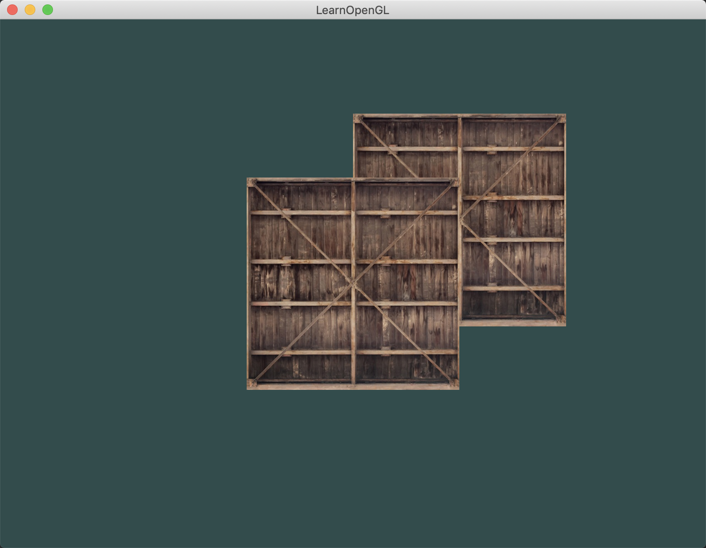
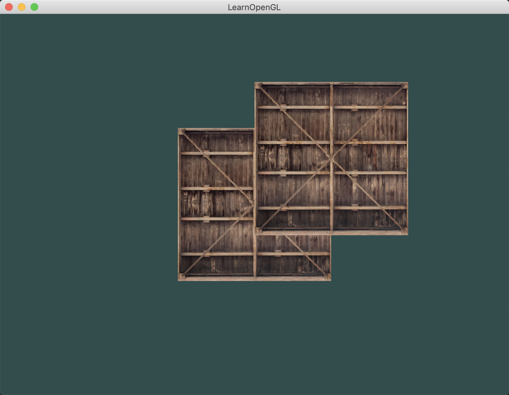
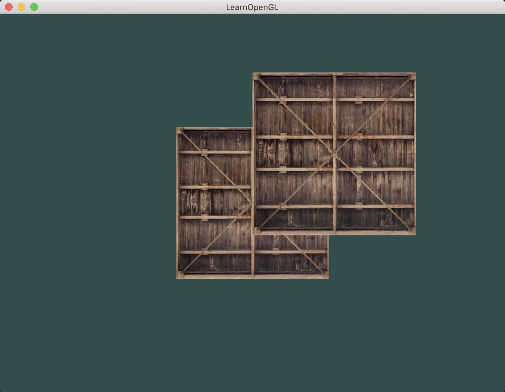

介绍：

绘制两个正方形，分别给两个正方形3种可变的条件：1，深度depth；2，layer；3，绘制顺序。

以下是所有的case：

**结论1：在相同layer和相同depth的情况下，覆盖区域是A还是B跟绘制顺序有关，在深度检测打开的情况下，<font color=red>谁先画显示谁，因为OpenGL默认的深度检测Function为GL_LESS(小于才通过检测)</font>**

```
/*
 * 相同depth 相同layer
 * 1.先画A，再画B // 现象：A先画的，A先把自己深度信息写在深度缓冲里，B后面画的时候，由于OpenGL默认深度检测的Function为GL_LESS（小于才通过），则A和B重叠部分还是显示A
 * 2.先画B，后画A // 现象：B先画的，B先把自己深度信息写在深度缓冲里，A后面画的时候，由于OpenGL默认深度检测的Function为GL_LESS（小于才通过），则A和B重叠部分还是显示B
 *
 * 结论：在相同layer和相同depth的情况下，覆盖区域是A还是B跟绘制顺序有关。
 * 不管先画谁，都有可能带来闪烁问题
 */
#define __MODE_SAME_DEPTH_SAME_LAYER_A_B__ // depth_A: 0, depth_B: 0; layer_A: 0, layer_B: 0; first draw A, second draw B
#define __MODE_SAME_DEPTH_SAME_LAYER_B_A__ // depth_A: 0, depth_B: 0; layer_A: 0, layer_B: 0; first draw B, second draw A
```

`__MODE_SAME_DEPTH_SAME_LAYER_A_B__`:



`__MODE_SAME_DEPTH_SAME_LAYER_B_A__`:




**结论2：在相同depth的情况下，覆盖区域是A还是B跟layer有关，谁大谁在上，跟绘制顺序无关**

```
/*
 * 相同depth A的layer大，B的layer小
 * 1.先画A，再画B（先画layer比较大的，再画layer比较小的）// 现象：A盖着B；在深度相同的情况下，以layer为准，跟绘制顺序无关，但这种情况可能会影响blend出错
 * 2.先画B，后画A（先画layer比较小的，再画layer比较大的; 这是正确的绘制操作）// 现象：A盖着B；在深度相同的情况下，以layer为准，跟绘制顺序无关
 *
 * 结论：在相同depth的情况下，覆盖区域是A还是B跟layer有关，谁大谁在上，跟绘制顺序无关
 */
#define __MODE_SAME_DEPTH_DIFF_LAYER_A_B__ // depth_A: 0, depth_B: 0; layer_A: 1, layer_B: 0; first draw A, second draw B
#define __MODE_SAME_DEPTH_DIFF_LAYER_B_A__ // depth_A: 0, depth_B: 0; layer_A: 1, layer_B: 0; first draw B, second draw A
```

`__MODE_SAME_DEPTH_DIFF_LAYER_A_B__`:


`__MODE_SAME_DEPTH_DIFF_LAYER_B_A__`:


**结论3：在相同layer的情况下，覆盖区域是A还是B跟depth有关，谁浅谁在上，跟绘制顺序无关**

```
/*
 * 相同layer A的深度比较深，B的深度比较浅（A是远处物体，B是近处物体）
 * 1.先画A，再画B（先画远处物体，再画近处物体；这是正确的绘制操作）// 现象：B盖着A
 * 2.先画B，后画A（先画近处物体，再画远处物体）// 现象：B盖着A；虽然是先画的近处物体B，但由于深度检测是打开的，所以后面画A的时候，深度检测不通过，A画不上覆盖区域，所以还是B盖着A（这种情况会导致blend不对）
 *
 * 结论：在相同layer的情况下，覆盖区域是A还是B跟depth有关，谁浅谁在上，跟绘制顺序无关
 */
#define __MODE_DIFF_DEPTH_SAME_LAYER_A_B__ // depth_A: 0, depth_B: 1; layer_A: 0, layer_B: 0; first draw A, second draw B
#define __MODE_DIFF_DEPTH_SAME_LAYER_B_A__ // depth_A: 0, depth_B: 1; layer_A: 0, layer_B: 0; first draw B, second draw A
```

`__MODE_DIFF_DEPTH_SAME_LAYER_A_B__`:



`__MODE_DIFF_DEPTH_SAME_LAYER_B_A__`:


**结论：<font color=red>深度检测的优先级要 大于 layer层级的比较，跟绘制顺序也没有任何关系</font>，绘制顺序只是影响blend可能会出问题。即在深度检测打开的情况下，谁浅谁在上。**

```
/*
 * A的深度比较深，B的深度比较浅（A是远处物体，B是近处物体）
 * 1.先画A，再画B（先画远处物体，再画近处物体；远处物体的layer小，近处物体的layer大；这是正常的绘制操作）// 现象：A盖着B
 * 2.先画A，再画B（先画远处物体，再画近处物体；远处物体的layer大，近处物体的layer小；这是不正常的绘制操作，深度绘制顺序是正确的，layer顺序是错误的，到底是以谁为生效呢？）// 现象：B盖着A。深度检测的优先级要大于layer，B在近处，所以B盖着A。
 * 3.先画B，后画A（先画近处物体，再画远处物体；远处物体的layer大，近处物体的layer小；这是不正常的绘制操作，深度绘制顺序是错误的，layer顺序是正确的，到底是以谁为生效呢？）// 现象：B盖着A。深度检测的优先级要大于layer，B在近处，所以B盖着A。跟绘制顺序无关。
 * 4.先画B，后画A（先画近处物体，再画远处物体；远处物体的layer小，近处物体的layer大；这是不正常的绘制操作，深度绘制顺序是错误的，layer顺序是错误的，到底是以谁为生效呢？）// 现象：B盖着A。深度检测的优先级要大于layer，B在近处，所以B盖着A。跟layer和绘制顺序无关。
 *
 * 结论：深度检测的优先级要 大于 layer层级的比较，跟绘制顺序也没有任何关系，绘制顺序只是影响blend可能会出问题。
 */
#define __MODE_DIFF_DEPTH_DIFF_LAYER_A_B_1__ // depth_A: 0, depth_B: 1; layer_A: 1, layer_B: 2; first draw A, second draw B
#define __MODE_DIFF_DEPTH_DIFF_LAYER_A_B_2__ // depth_A: 0, depth_B: 1; layer_A: 2, layer_B: 1; first draw A, second draw B
#define __MODE_DIFF_DEPTH_DIFF_LAYER_B_A_1__ // depth_A: 0, depth_B: 1; layer_A: 2, layer_B: 1; first draw B, second draw A
define __MODE_DIFF_DEPTH_DIFF_LAYER_B_A_2__ // depth_A: 0, depth_B: 1; layer_A: 1, layer_B: 2; first draw B, second draw A
```

上面四种情况的结果都为：


这里还有一种比较好的解释：layer其实就是glPolygonOffset，这里的offset实际上就是在当前的z值加一个offset，以z+offset生效