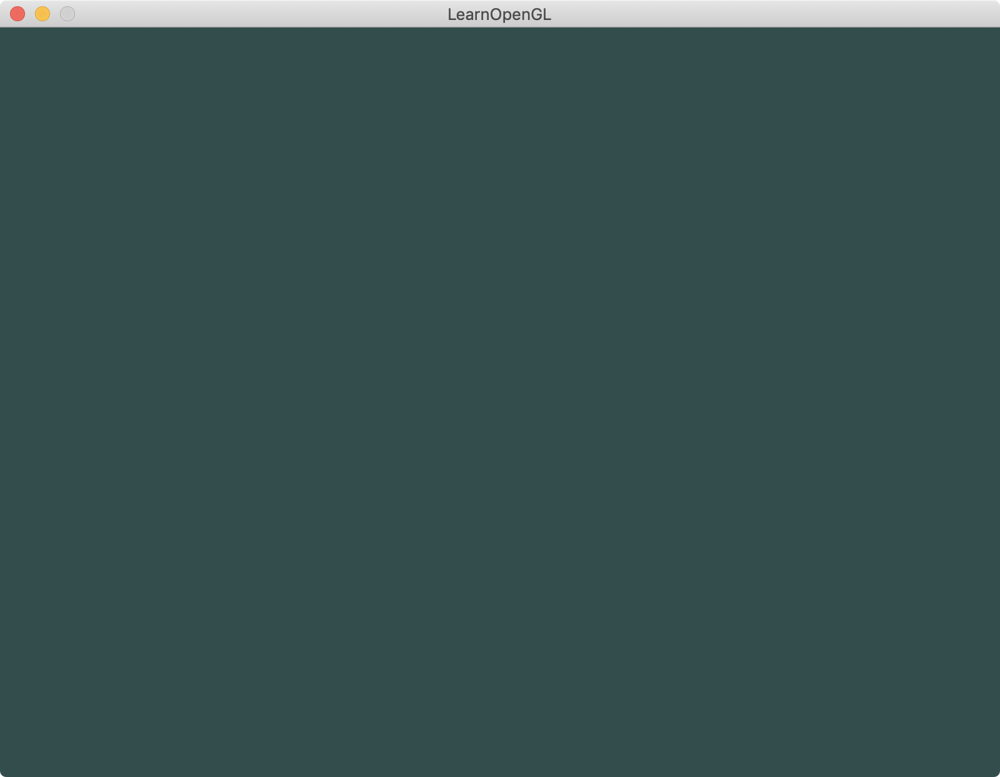

介绍：初始化glfw。glclear为0.2f, 0.3f, 0.3f, 1.0f




----

if link error:

```
[ 75%] Linking CXX executable bin/1.getting_started/1.getting_started__1.3.hello_glfw
Apple LLVM version 10.0.0 (clang-1000.11.45.5)
Target: x86_64-apple-darwin18.2.0
Thread model: posix
InstalledDir: /Applications/Xcode.app/Contents/Developer/Toolchains/XcodeDefault.xctoolchain/usr/bin
 "/Applications/Xcode.app/Contents/Developer/Toolchains/XcodeDefault.xctoolchain/usr/bin/ld" -demangle -lto_library /Applications/Xcode.app/Contents/Developer/Toolchains/XcodeDefault.xctoolchain/usr/lib/libLTO.dylib -dynamic -arch x86_64 -macosx_version_min 10.14.0 -syslibroot /Applications/Xcode.app/Contents/Developer/Platforms/MacOSX.platform/Developer/SDKs/MacOSX10.14.sdk -o bin/1.getting_started/1.getting_started__1.3.hello_glfw -L/Users/wangdong/github/opengl/LearnOpenGL/lib -search_paths_first -headerpad_max_install_names CMakeFiles/1.getting_started__1.3.hello_glfw.dir/src/1.getting_started/1.3.hello_glfw/01_hello_glfw.cpp.o -rpath /Users/wangdong/github/opengl/LearnOpenGL/lib -framework Cocoa -framework IOKit -framework OpenGL -framework CoreVideo /usr/local/lib/libglfw.dylib /usr/local/lib/libassimp.dylib libSTB_IMAGE.a libGLAD.a -lc++ -lSystem /Applications/Xcode.app/Contents/Developer/Toolchains/XcodeDefault.xctoolchain/usr/lib/clang/10.0.0/lib/darwin/libclang_rt.osx.a
Undefined symbols for architecture x86_64:
  "_glewExperimental", referenced from:
      _main in 01_hello_glfw.cpp.o
ld: symbol(s) not found for architecture x86_64
clang: error: linker command failed with exit code 1 (use -v to see invocation)
```
解决方案1：
```
1. 原因：(http://www.cocoachina.com/ios/20170221/18737.html)
        编译项目时，因为静态库没有链接进工程，所以静态库就不会参与编译，
        而项目某些文件（.m文件）又引用（或者说依赖）了静态库，所以自然会报错，
        而报的错就是经典的 Undefined symbols for architecture XXX这一类的错误
2. brew install glew
3. open "make-build-debug/CMakeFiles/1.getting_started__1.3.hello_glfw.dir/link.txt"
  add '/usr/local/lib/libGLEW.dylib' in link.
```
解决方案2（推荐）：
```
in "CMakeLists.txt", add:
    find_package(GLEW REQUIRED)
    message(STATUS "Found GLEW in ${GLEW_INCLUDE_DIR}")
    SET(APPLE_LIBS ${APPLE_LIBS} ${GLFW3_LIBRARY} ${ASSIMP_LIBRARY} ${GLEW_LIBRARY})
```
