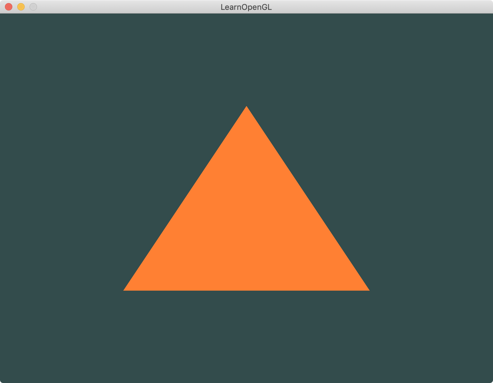

介绍：绘制三角形，使用VAO VBO。





---

[link]: https://learnopengl-cn.github.io/01%20Getting%20started/04%20Hello%20Triangle/


---


1. 顶点数组对象：Vertex Array Object，VAO
2. 顶点缓冲对象：Vertex Buffer Object，VBO
3. 索引缓冲对象：Element Buffer Object，EBO或Index Buffer Object，IBO


# shader的理解

图形渲染管线接受一组3D坐标，然后把它们转变为你屏幕上的有色2D像素输出。

图形渲染管线可以被划分为几个阶段，每个阶段将会把前一个阶段的输出作为输入。

所有这些阶段都是高度专门化的（它们都有一个特定的函数），并且很容易并行执行。

正是由于它们具有并行执行的特性，当今**大多数显卡都有成千上万的小处理核心，它们在GPU上为每一个（渲染管线）阶段运行各自的小程序，从而在图形渲染管线中快速处理你的数据**。

这些小程序叫做着色器(Shader)。


# 图形渲染管线的每个阶段的抽象展示

（蓝色部分代表的是我们可以注入自定义的着色器的部分）


- 图形渲染管线的第一个部分是顶点着色器(Vertex Shader)，它把一个单独的顶点作为输入。顶点着色器主要的目的是把3D坐标转为另一种3D坐标（后面会解释），同时顶点着色器允许我们对顶点属性进行一些基本处理。

- 图元装配(Primitive Assembly)阶段将顶点着色器输出的所有顶点作为输入（如果是**GL_POINTS**，那么就是一个顶点）（**GL_TRIANGLES**、**GL_LINE_STRIP**等），并所有的点装配成指定图元的形状；本节例子中是一个三角形。

- 图元装配阶段的输出会传递给几何着色器(Geometry Shader)。几何着色器把图元形式的一系列顶点的集合作为输入，它可以通过产生新顶点构造出新的（或是其它的）图元来生成其他形状。例子中，它生成了另一个三角形。

- 几何着色器的输出会被传入光栅化阶段(Rasterization Stage)，这里它会把图元映射为最终屏幕上相应的像素，生成供片段着色器(Fragment Shader)使用的片段(Fragment)。在片段着色器运行之前会执行裁切(**Clipping**)。裁切会丢弃超出你的视图以外的所有像素，用来提升执行效率。

- 片段着色器的主要目的是计算一个像素的最终颜色，这也是所有OpenGL高级效果产生的地方。通常，片段着色器包含3D场景的数据（比如光照、阴影、光的颜色等等），这些数据可以被用来计算最终像素的颜色。

- 在所有对应颜色值确定以后，最终的对象将会被传到最后一个阶段，我们叫做Alpha测试和混合(**Blending**)阶段。这个阶段检测片段的对应的深度（和模板(**Stencil**)）值（后面会讲），用它们来判断这个像素是其它物体的前面还是后面，决定是否应该丢弃。这个阶段也会检查alpha值（alpha值定义了一个物体的透明度）并对物体进行混合(Blend)。所以，即使在片段着色器中计算出来了一个像素输出的颜色，在渲染多个三角形的时候最后的像素颜色也可能完全不同。（**depth**）


# VBO

我们通过顶点缓冲对象(Vertex Buffer Objects, VBO)管理这个内存，它会在**GPU内存（通常被称为显存）中储存大量顶点**。使用这些缓冲对象的好处是我们可以一次性的发送一大批数据到显卡上，而不是每个顶点发送一次。从CPU把数据发送到显卡相对较慢，所以只要可能我们都要尝试尽量一次性发送尽可能多的数据。当数据发送至显卡的内存中后，顶点着色器几乎能立即访问顶点，这是个非常快的过程。

顶点缓冲对象是我们在[OpenGL](https://learnopengl-cn.github.io/01%20Getting%20started/01%20OpenGL/)教程中第一个出现的OpenGL对象。就像OpenGL中的其它对象一样，这个缓冲有一个独一无二的ID，所以我们可以使用glGenBuffers函数和一个缓冲ID生成一个VBO对象：

```
unsigned int VBO;
glGenBuffers(1, &VBO);
```

**OpenGL有很多缓冲对象类型，顶点缓冲对象的缓冲类型是GL_ARRAY_BUFFER（还有GL_COPY_READ_BUFFER, GL_COPY_WRITE_BUFFER,`GL_ELEMENT_ARRAY_BUFFER`, GL_PIXEL_PACK_BUFFER, GL_PIXEL_UNPACK_BUFFER, GL_TEXTURE_BUFFER, GL_TRANSFORM_FEEDBACK_BUFFER, or GL_UNIFORM_BUFFER）**。OpenGL允许我们同时绑定多个缓冲，只要它们是不同的缓冲类型。我们可以使用glBindBuffer函数把新创建的缓冲绑定到GL_ARRAY_BUFFER目标上：

```
glBindBuffer(GL_ARRAY_BUFFER, VBO);  
```

**从这一刻起，我们使用的任何（在GL_ARRAY_BUFFER目标上的）缓冲调用都会用来配置当前绑定的缓冲(VBO)**。然后我们可以调用glBufferData函数，它会把之前定义的顶点数据复制到缓冲的内存中：

```
glBufferData(GL_ARRAY_BUFFER, sizeof(vertices), vertices, GL_STATIC_DRAW);
```

glBufferData是一个专门用来把用户定义的数据复制到当前绑定缓冲的函数。它的第一个参数是目标缓冲的类型：顶点缓冲对象当前绑定到GL_ARRAY_BUFFER目标上。第二个参数指定传输数据的大小(以字节为单位)；用一个简单的`sizeof`计算出顶点数据大小就行。第三个参数是我们希望发送的实际数据。

第四个参数指定了我们希望显卡如何管理给定的数据。它有三种形式：

- `GL_STATIC_DRAW` ：数据不会或几乎不会改变。
- `GL_DYNAMIC_DRAW`：数据会被改变很多。
- `GL_STREAM_DRAW`：数据每次绘制时都会改变。

三角形的位置数据不会改变，每次渲染调用时都保持原样，所以它的使用类型最好是GL_STATIC_DRAW。如果，**比如说一个缓冲中的数据将频繁被改变，那么使用的类型就是GL_DYNAMIC_DRAW或GL_STREAM_DRAW**，这样就**能确保显卡把数据放在能够高速写入的内存部分**。

**现在我们已经把顶点数据储存在显卡的内存中，用VBO这个顶点缓冲对象管理**。


# glVertexAttribPointer & glEnableVertexAttribArray

**每个顶点属性(`layout (location = 0) in vec3 position)`从一个VBO管理的内存中获得它的数据，而具体是从哪个VBO（程序中可以有多个VBO）获取则是通过在调用glVetexAttribPointer时绑定到GL_ARRAY_BUFFER的VBO决定的。由于在调用glVetexAttribPointer之前绑定的是先前定义的VBO对象，顶点属性`0`现在会链接到它的顶点数据。**

现在我们已经定义了OpenGL该如何解释顶点数据，我们现在应该使用glEnableVertexAttribArray，以顶点属性位置值作为参数，启用顶点属性；顶点属性默认是禁用的。自此，所有东西都已经设置好了：我们使用一个顶点缓冲对象将顶点数据初始化至缓冲中，建立了一个顶点和一个顶点着色器，并告诉了OpenGL如何把顶点数据链接到顶点着色器的顶点属性上。在OpenGL中绘制一个物体，代码会像是这样：

```
// 0. 复制顶点数组到缓冲中供OpenGL使用
glBindBuffer(GL_ARRAY_BUFFER, VBO);
glBufferData(GL_ARRAY_BUFFER, sizeof(vertices), vertices, GL_STATIC_DRAW);
glBindBuffer(GL_ELEMENT_ARRAY_BUFFER, EBO);
glBufferData(GL_ELEMENT_ARRAY_BUFFER, sizeof(indices), indices, GL_STATIC_DRAW);
// 1. 设置顶点属性指针
GLuint location = 0;
glVertexAttribPointer(location, 3, GL_FLOAT, GL_FALSE, 3 * sizeof(float), (void*)0);
glEnableVertexAttribArray(location);
// 2. 当我们渲染一个物体时要使用着色器程序
glUseProgram(shaderProgram);
// 3. 绘制物体
glDrawElements(GL_TRIANGLES, 6, GL_UNSIGNED_INT, 0);
```

每当我们绘制一个物体的时候都必须重复这一过程。这看起来可能不多，但是如果有超过5个顶点属性，上百个不同物体呢（这其实并不罕见）。绑定正确的缓冲对象，为每个物体配置所有顶点属性很快就变成一件麻烦事。**有没有一些方法可以使我们把所有这些状态配置储存在一个对象中，并且可以通过绑定这个对象来恢复状态呢？答案就是VAO。**


# VAO

顶点数组对象(Vertex Array Object, VAO)可以像顶点缓冲对象那样被绑定，任何随后的顶点属性调用都会储存在这个VAO中。这样的好处就是，当配置顶点属性指针时，**你只需要将那些调用执行一次，之后再绘制物体的时候只需要绑定相应的VAO就行了**。这使在不同顶点数据和属性配置之间切换变得非常简单，只需要绑定不同的VAO就行了。刚刚设置的所有状态都将存储在VAO中

**OpenGL的核心模式要求我们使用VAO，所以它知道该如何处理我们的顶点输入。如果我们绑定VAO失败，OpenGL会拒绝绘制任何东西。**

一个顶点数组对象会储存以下这些内容：

- glEnableVertexAttribArray和glDisableVertexAttribArray的调用。
- 通过glVertexAttribPointer设置的顶点属性配置。
- 通过glVertexAttribPointer调用与顶点属性关联的顶点缓冲对象。


创建一个VAO和创建一个VBO很类似：

```
unsigned int VAO;
glGenVertexArrays(1, &VAO);
```

要想使用VAO，要做的只是使用glBindVertexArray绑定VAO。从绑定之后起，我们应该绑定和配置对应的VBO和属性指针，之后解绑VAO供之后使用。当我们打算绘制一个物体的时候，我们只要在绘制物体前简单地把VAO绑定到希望使用的设定上就行了。这段代码应该看起来像这样：

```
// ..:: 初始化代码（只运行一次 (除非你的物体频繁改变)） :: ..
// 1. 绑定VAO
glBindVertexArray(VAO);
// 2. 把顶点数组复制到缓冲中供OpenGL使用
glBindBuffer(GL_ARRAY_BUFFER, VBO);
glBufferData(GL_ARRAY_BUFFER, sizeof(vertices), vertices, GL_STATIC_DRAW);
// 3. 设置顶点属性指针
glVertexAttribPointer(0, 3, GL_FLOAT, GL_FALSE, 3 * sizeof(float), (void*)0);
glEnableVertexAttribArray(0);

[...]

// ..:: 绘制代码（渲染循环中） :: ..
// 4. 绘制物体
glUseProgram(shaderProgram);
glBindVertexArray(VAO);
someOpenGLFunctionThatDrawsOurTriangle();
```

就这么多了！前面做的一切都是等待这一刻，一个储存了我们顶点属性配置和应使用的VBO的顶点数组对象。一般当你打算绘制多个物体时，你首先要生成/配置所有的VAO（和必须的VBO及属性指针)，然后储存它们供后面使用。**当我们打算绘制物体的时候就拿出相应的VAO，绑定它，绘制完物体后，再解绑VAO。**


# IBO

索引缓冲对象(Element Buffer Object，EBO，也叫Index Buffer Object，IBO)。要解释索引缓冲对象的工作方式最好还是举个例子：假设我们不再绘制一个三角形而是绘制一个矩形。我们可以绘制两个三角形来组成一个矩形（OpenGL主要处理三角形）。这会生成下面的顶点的集合：

```
float vertices[] = {
    // 第一个三角形
    0.5f, 0.5f, 0.0f,   // 右上角
    0.5f, -0.5f, 0.0f,  // 右下角
    -0.5f, 0.5f, 0.0f,  // 左上角
    // 第二个三角形
    0.5f, -0.5f, 0.0f,  // 右下角
    -0.5f, -0.5f, 0.0f, // 左下角
    -0.5f, 0.5f, 0.0f   // 左上角
};
```

可以看到，有几个顶点叠加了。我们指定了`右下角`和`左上角`两次！**一个矩形只有4个而不是6个顶点，这样就产生50%的额外开销**。当我们有包括上千个三角形的模型之后这个问题会更糟糕，这会产生一大堆浪费。更好的解决方案是只储存不同的顶点，并设定绘制这些顶点的顺序。这样子**我们只要储存4个顶点就能绘制矩形了，之后只要指定绘制的顺序就行了**。如果OpenGL提供这个功能就好了，对吧？

很幸运，索引缓冲对象的工作方式正是这样的。和顶点缓冲对象一样，EBO也是一个缓冲，它专门储存索引，OpenGL调用这些顶点的索引来决定该绘制哪个顶点。所谓的索引绘制(Indexed Drawing)正是我们问题的解决方案。首先，我们先要定义（不重复的）顶点，和绘制出矩形所需的索引：

```
float vertices[] = {
    0.5f, 0.5f, 0.0f,   // 右上角
    0.5f, -0.5f, 0.0f,  // 右下角
    -0.5f, -0.5f, 0.0f, // 左下角
    -0.5f, 0.5f, 0.0f   // 左上角
};

unsigned int indices[] = { // 注意索引从0开始! 
    0, 1, 3, // 第一个三角形
    1, 2, 3  // 第二个三角形
};
```

你可以看到，当时用索引的时候，我们只定义了4个顶点，而不是6个。下一步我们需要创建索引缓冲对象：

```
unsigned int EBO;
glGenBuffers(1, &EBO);
```

与VBO类似，我们先绑定EBO然后用glBufferData把索引复制到缓冲里。同样，和VBO类似，我们会把这些函数调用放在绑定和解绑函数调用之间，只不过这次我们把缓冲的类型定义为GL_ELEMENT_ARRAY_BUFFER。

```
glBindBuffer(GL_ELEMENT_ARRAY_BUFFER, EBO);
glBufferData(GL_ELEMENT_ARRAY_BUFFER, sizeof(indices), indices, GL_STATIC_DRAW);
```

要注意的是，我们传递了GL_ELEMENT_ARRAY_BUFFER当作缓冲目标。最后一件要做的事是用glDrawElements来替换glDrawArrays函数，来指明我们从索引缓冲渲染。使用glDrawElements时，我们会使用当前绑定的索引缓冲对象中的索引进行绘制：

```
glBindBuffer(GL_ELEMENT_ARRAY_BUFFER, EBO);
glDrawElements(GL_TRIANGLES, 6, GL_UNSIGNED_INT, 0);
```

第一个参数指定了我们绘制的模式，这个和glDrawArrays的一样。第二个参数是我们打算绘制顶点的个数，这里填6，也就是说我们一共需要绘制6个顶点。第三个参数是索引的类型，这里是GL_UNSIGNED_INT。最后一个参数里我们可以指定EBO中的偏移量（或者传递一个索引数组，但是这是当你不在使用索引缓冲对象的时候），但是我们会在这里填写0。

**glDrawElements函数从当前绑定到GL_ELEMENT_ARRAY_BUFFER目标的EBO中获取索引。这意味着我们必须在每次要用索引渲染一个物体时绑定相应的EBO，这还是有点麻烦。不过顶点数组对象同样可以保存索引缓冲对象的绑定状态。VAO绑定时正在绑定的索引缓冲对象会被保存为VAO的元素缓冲对象。绑定VAO的同时也会自动绑定EBO。**


当目标是GL_ELEMENT_ARRAY_BUFFER的时候，VAO会储存glBindBuffer的函数调用。这也意味着它也会储存解绑调用，所以确保你没有在解绑VAO之前解绑索引数组缓冲，否则它就没有这个EBO配置了。

最后的初始化和绘制代码现在看起来像这样：

```
// ..:: 初始化代码 :: ..
// 1. 绑定顶点数组对象
glBindVertexArray(VAO);
// 2. 把我们的顶点数组复制到一个顶点缓冲中，供OpenGL使用
glBindBuffer(GL_ARRAY_BUFFER, VBO);
glBufferData(GL_ARRAY_BUFFER, sizeof(vertices), vertices, GL_STATIC_DRAW);
// 3. 复制我们的索引数组到一个索引缓冲中，供OpenGL使用
glBindBuffer(GL_ELEMENT_ARRAY_BUFFER, EBO);
glBufferData(GL_ELEMENT_ARRAY_BUFFER, sizeof(indices), indices, GL_STATIC_DRAW);
// 4. 设定顶点属性指针
glVertexAttribPointer(0, 3, GL_FLOAT, GL_FALSE, 3 * sizeof(float), (void*)0);
glEnableVertexAttribArray(0);

[...]

// ..:: 绘制代码（渲染循环中） :: ..
glUseProgram(shaderProgram);
glBindVertexArray(VAO);
glDrawElements(GL_TRIANGLES, 6, GL_UNSIGNED_INT, 0)
glBindVertexArray(0);
```

运行程序会获得下面这样的图片的结果。左侧图片看应该起来很熟悉，而右侧的则是使用线框模式(Wireframe Mode)绘制的。线框矩形可以显示出矩形的确是由两个三角形组成的。


**线框模式(Wireframe Mode)**

要想用线框模式绘制你的三角形，你可以通过`glPolygonMode(GL_FRONT_AND_BACK, GL_LINE)`函数配置OpenGL如何绘制图元。第一个参数表示我们打算将其应用到所有的三角形的正面和背面，第二个参数告诉我们用线来绘制。之后的绘制调用会一直以线框模式绘制三角形，直到我们用`glPolygonMode(GL_FRONT_AND_BACK, GL_FILL)`将其设置回默认模式。