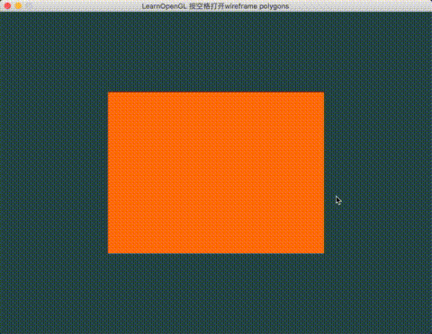

## usage:

按空格可以进入线框模式。

绘制四角形，使用IBO。



---

1.EBO(IBO)

2.线框模式

```
// Uncommenting this call will result in wireframe polygons.
glPolygonMode(GL_FRONT_AND_BACK, GL_LINE);
/*
第一个参数说：我们打算应用到所有的三角形的前面和背面，
第二个参数告诉我们用线来绘制。在随后的绘制函数调用后会一直以线框模式绘制三角形，
直到我们用glPolygonMode(GL_FRONT_AND_BACK, GL_FILL)设置回了默认模式。
*/
```