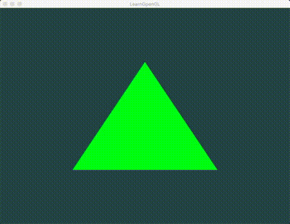

案例介绍：运行demo后，三角形的颜色会随着时间不停得改变(从绿变黑，再变绿)




---

glUniform4f的运用（从 cpu 传 数据 到 顶点着色器或片元着色器）

```
while (!glfwWindowShouldClose(window))
{
    ....

    // Update the uniform color
    GLfloat timeValue = glfwGetTime();
    GLfloat greenValue = (sin(timeValue) / 2) + 0.5;
    GLint vertexColorLocation = glGetUniformLocation(shaderProgram, "ourColor");
    glUniform4f(vertexColorLocation, 0.0f, greenValue, 0.0f, 1.0f);

    ...
}
```

---

着色器(Shader)是**运行在GPU上的小程序**。这些小程序为图形渲染管线的某个特定部分而运行。从基本意义上来说，着色器只是一种把输入转化为输出的程序。着色器也是一种非常独立的程序，因为它们之间不能相互通信；它们之间**唯一的沟通只有通过输入和输出**。

---

一个典型的着色器有下面的结构：

```
#version version_number
in type in_variable_name;
in type in_variable_name;

out type out_variable_name;

uniform type uniform_name;

void main()
{
  // 处理输入并进行一些图形操作
  ...
  // 输出处理过的结果到输出变量
  out_variable_name = weird_stuff_we_processed;
}
```

当我们特别谈论到顶点着色器的时候，每个输入变量也叫顶点属性(Vertex Attribute)。我们能声明的顶点属性是有上限的，它一般由硬件来决定。**OpenGL确保至少有16个包含4分量的顶点属性可用，但是有些硬件或许允许更多的顶点属性，你可以查询GL_MAX_VERTEX_ATTRIBS来获取具体的上限：**

```
int nrAttributes;
glGetIntegerv(GL_MAX_VERTEX_ATTRIBS, &nrAttributes);
std::cout << "Maximum nr of vertex attributes supported: " << nrAttributes << std::endl;
```

通常情况下它至少会返回16个，大部分情况下是够用了。

---

### 向量

GLSL中的向量是一个可以包含有1、2、3或者4个分量的容器，分量的类型可以是前面默认基础类型的任意一个。它们可以是下面的形式（`n`代表分量的数量）：

| 类型    | 含义                            |
| ------- | ------------------------------- |
| `vecn`  | 包含`n`个float分量的默认向量    |
| `bvecn` | 包含`n`个bool分量的向量         |
| `ivecn` | 包含`n`个int分量的向量          |
| `uvecn` | 包含`n`个unsigned int分量的向量 |
| `dvecn` | 包含`n`个double分量的向量       |

大多数时候我们使用`vecn`，因为float足够满足大多数要求了。

一个向量的分量可以通过`vec.x`这种方式获取，这里`x`是指这个向量的第一个分量。你可以分别使用`.x`、`.y`、`.z`和`.w`来获取它们的第1、2、3、4个分量。GLSL也允许你对颜色使用`rgba`，或是对纹理坐标使用`stpq`访问相同的分量。

向量这一数据类型也允许一些有趣而灵活的分量选择方式，叫做重组(Swizzling)。重组允许这样的语法：

```
vec2 someVec;
vec4 differentVec = someVec.xyxx;
vec3 anotherVec = differentVec.zyw;
vec4 otherVec = someVec.xxxx + anotherVec.yxzy;
```

你可以使用上面4个字母任意组合来创建一个和原来向量一样长的（同类型）新向量，只要原来向量有那些分量即可；然而，你不允许在一个`vec2`向量中去获取`.z`元素。我们也可以把一个向量作为一个参数传给不同的向量构造函数，以减少需求参数的数量：

```
vec2 vect = vec2(0.5, 0.7);
vec4 result = vec4(vect, 0.0, 0.0);
vec4 otherResult = vec4(result.xyz, 1.0);
```

向量是一种灵活的数据类型，我们可以把用在各种输入和输出上。

---

