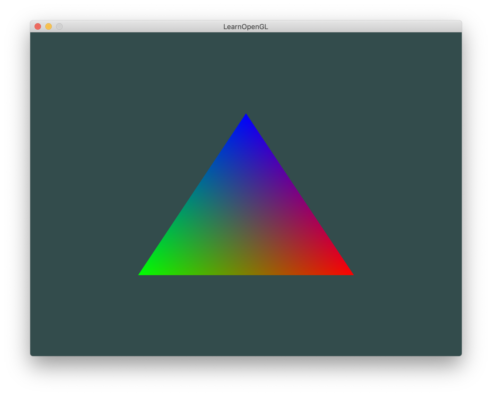

介绍：画一个三角形，这是一个彩色的三角形。指定三角形三个顶点分别使用不同的颜色值，中间填充区域会根据这三个颜色进行插值计算，所以是彩色的三角形。




---

本demo要点：顶点数据和颜色数据写在一个vertices数组里，通过glVertexAttribPointer来指定不同的数据

```
GLfloat vertices[] = {
		// Positions         // Colors
		0.5f, -0.5f, 0.0f,  1.0f, 0.0f, 0.0f,  // Bottom Right
		-0.5f, -0.5f, 0.0f,  0.0f, 1.0f, 0.0f,  // Bottom Left
		0.0f,  0.5f, 0.0f,  0.0f, 0.0f, 1.0f   // Top 
	};

GLuint VBO, VAO;
// gen VBO and VAO
glGenVertexArrays(1, &VAO);
glGenBuffers(1, &VBO);
// bind VAO
glBindVertexArray(VAO);

// bind VBO
glBindBuffer(GL_ARRAY_BUFFER, VBO);
// bind buffer data
glBufferData(GL_ARRAY_BUFFER, sizeof(vertices), vertices, GL_STATIC_DRAW);

// bind完buffer数据之后，调用glVertexAttribPointer来指定数据格式和顺序
// Position attribute
GLuint loc_pos = 0;
glVertexAttribPointer(loc_pos, 3, GL_FLOAT, GL_FALSE, 6 * sizeof(GLfloat), (GLvoid*)0);
glEnableVertexAttribArray(loc_pos); // 记得开启location
// Color attribute
GLuint loc_color = 1;
glVertexAttribPointer(loc_color, 3, GL_FLOAT, GL_FALSE, 6 * sizeof(GLfloat), 
                      (GLvoid*)(3 * sizeof(GLfloat))); // 最后一个参数是指数组的起始位置
glEnableVertexAttribArray(loc_color); // 记得开启location
```

---


因为我们在data中添加了另一个顶点属性（顶点数据和颜色数据），并且更新了VBO的内存，我们就必须重新配置顶点属性指针。更新后的VBO内存中的数据现在看起来像这样：


知道了现在使用的布局，我们就可以使用glVertexAttribPointer函数更新顶点格式，

```
// 位置属性
glVertexAttribPointer(0, 3, GL_FLOAT, GL_FALSE, 6 * sizeof(float), (void*)0);
glEnableVertexAttribArray(0);
// 颜色属性
glVertexAttribPointer(1, 3, GL_FLOAT, GL_FALSE, 6 * sizeof(float), (void*)(3* sizeof(float)));
glEnableVertexAttribArray(1);
```

glVertexAttribPointer函数的前几个参数比较明了。这次我们配置属性位置值为1的顶点属性。颜色值有3个float那么大，我们不去标准化这些值。

由于我们现在有了两个顶点属性，我们不得不重新计算**步长**值。为获得数据队列中下一个属性值（比如位置向量的下个`x`分量）我们必须向右移动6个float，其中3个是位置值，另外3个是颜色值。这使我们的步长值为6乘以float的字节数（=24字节）。
同样，这次我们必须指定一个偏移量。对于每个顶点来说，位置顶点属性在前，所以它的偏移量是0。颜色属性紧随位置数据之后，所以偏移量就是`3 * sizeof(float)`，用字节来计算就是12字节。

---

这个图片可能不是你所期望的那种，**因为我们只提供了3个颜色，而不是我们现在看到的大调色板**。这是在**片段着色器**中进行的所谓**片段插值(Fragment Interpolation)**的结果。当渲染一个三角形时，**光栅化(Rasterization)阶段通常会造成比原指定顶点更多的片段**。**光栅会根据每个片段在三角形形状上所处相对位置决定这些片段的位置。**
**基于这些位置，它会插值(Interpolate)所有片段着色器的输入变量**。比如说，我们有一个线段，上面的端点是绿色的，下面的端点是蓝色的。如果一个片段着色器在线段的70%的位置运行，它的颜色输入属性就会是一个绿色和蓝色的线性结合；更精确地说就是30%蓝 + 70%绿。

这正是在这个三角形中发生了什么。我们有3个顶点，和相应的3个颜色，从这个三角形的像素来看它可能包含50000左右的片段，片段着色器为这些像素进行插值颜色。如果你仔细看这些颜色就应该能明白了：红首先变成到紫再变为蓝色。**片段插值会被应用到片段着色器的所有输入属性上**。