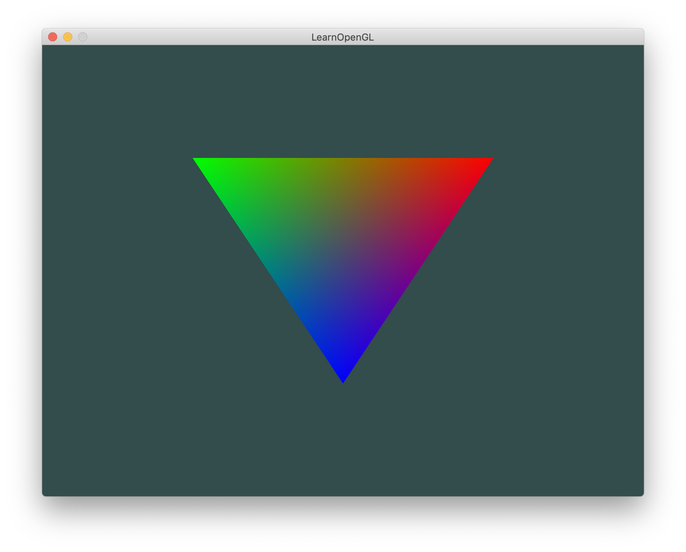
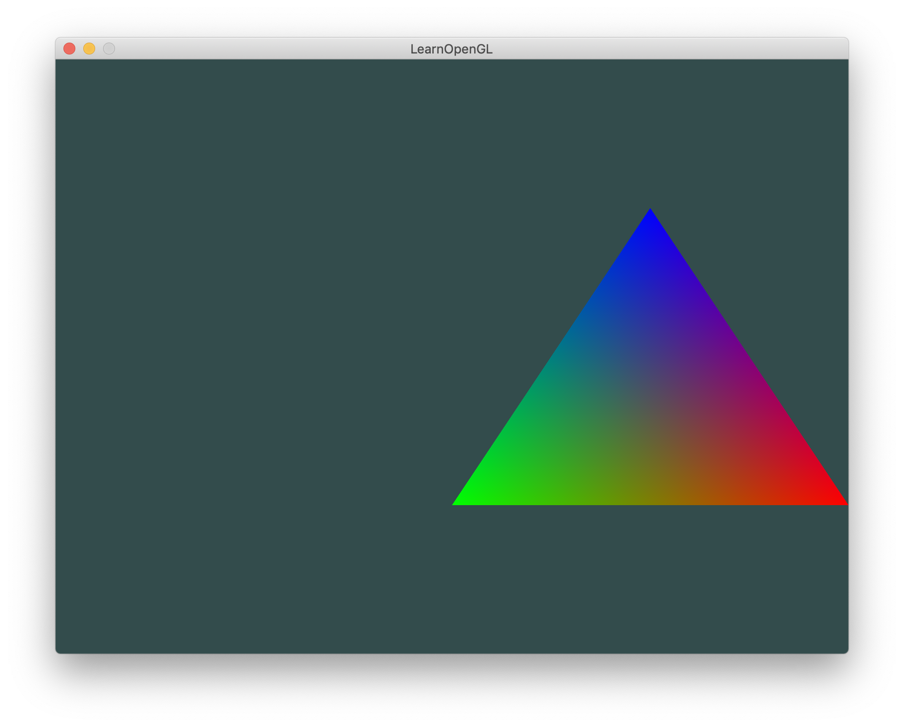
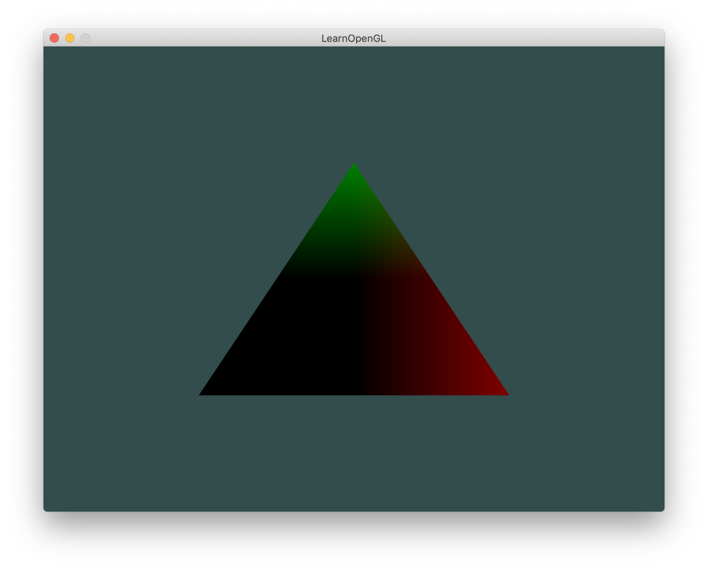

## 介绍

`_MODE_DEFINE_` ：运行后是一个倒置的三角形。（vs_invert.vert的着色器中，将y置反了）




`_MODE_OFFSET_` ：运行后是一个平移后的三角形。（vs_offset.vert的着色器中，x加了一个offset）




`_MODE_USE_POS_` ：运行后的三角形，左下角是黑色的。(fs_use_pos.frag的着色器中，color值使用的是顶点位置。注意若顶点位置小于0，则会被强制转为0，所以左下角是黑色的。详见fs_use_pos.frag着色器)




---

1.封装shader类；2.将着色器提出来，成为一个单独的文件，程序从文件中读取

使用c++读取文件代码：

```c++
vertexPath作为参数从外界传入。

// 1. Retrieve the vertex/fragment source code from filePath
std::string vertexCode;
std::ifstream vShaderFile;
// ensures ifstream objects can throw exceptions:
vShaderFile.exceptions(std::ifstream::badbit);
try
{
    // Open files
    vShaderFile.open(vertexPath);
    std::stringstream vShaderStream;
    // Read file's buffer contents into streams
    vShaderStream << vShaderFile.rdbuf();
    // close file handlers
    vShaderFile.close();
    // Convert stream into string
    vertexCode = vShaderStream.str();
}
catch (std::ifstream::failure e)
{
    std::cout << "ERROR::SHADER::FILE_NOT_SUCCESFULLY_READ" << std::endl;
}
```

