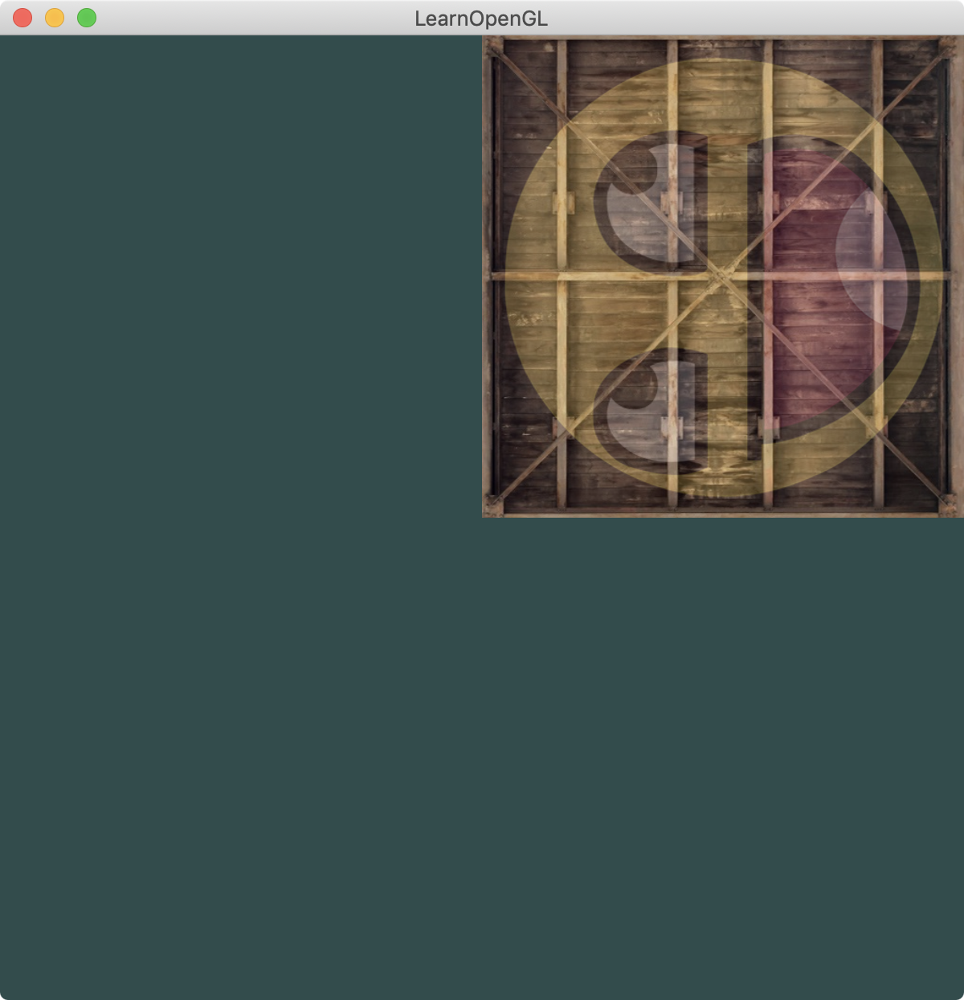
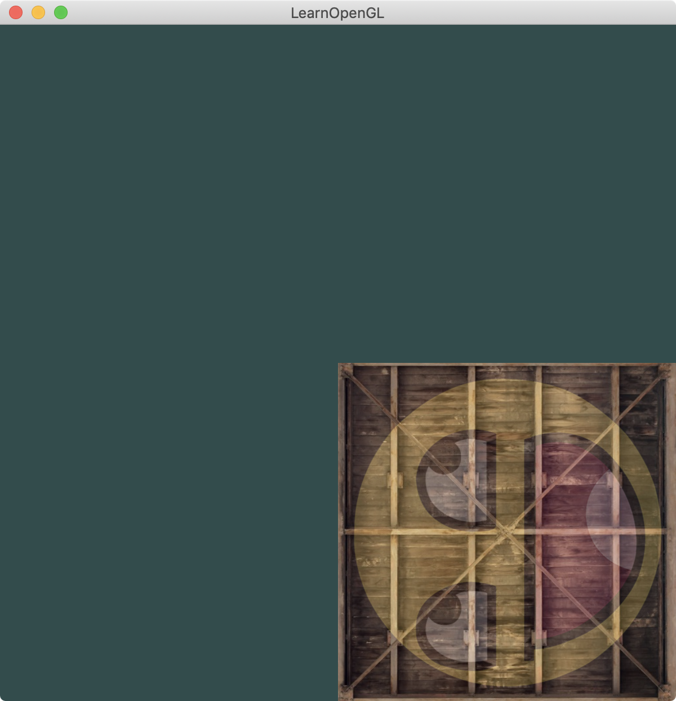
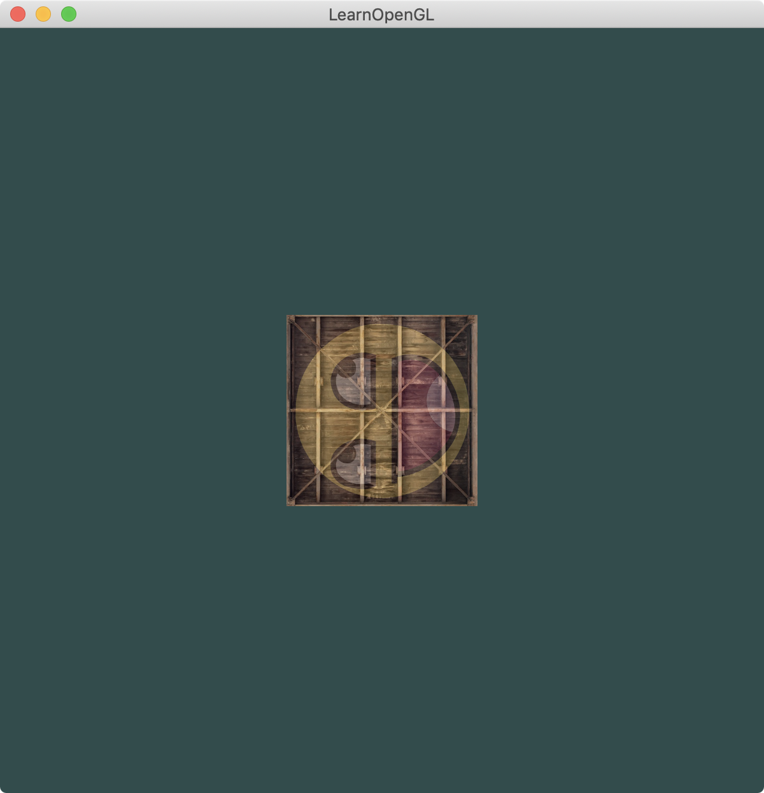
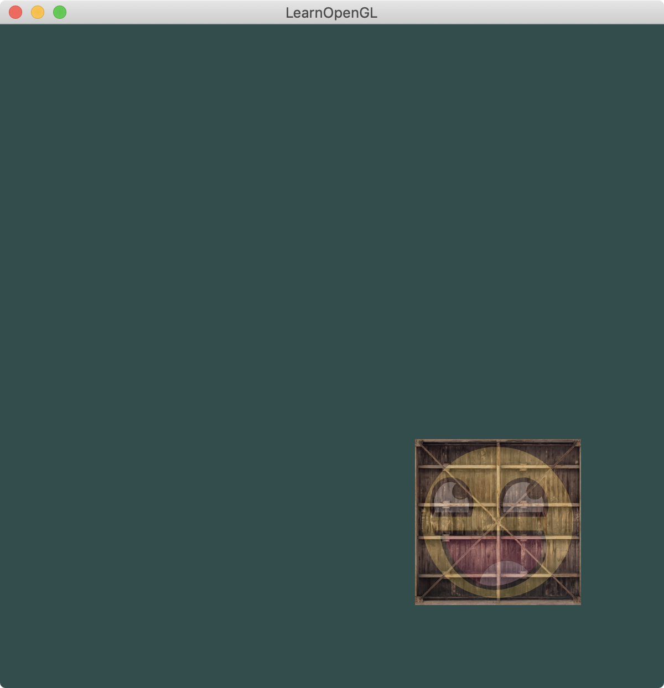
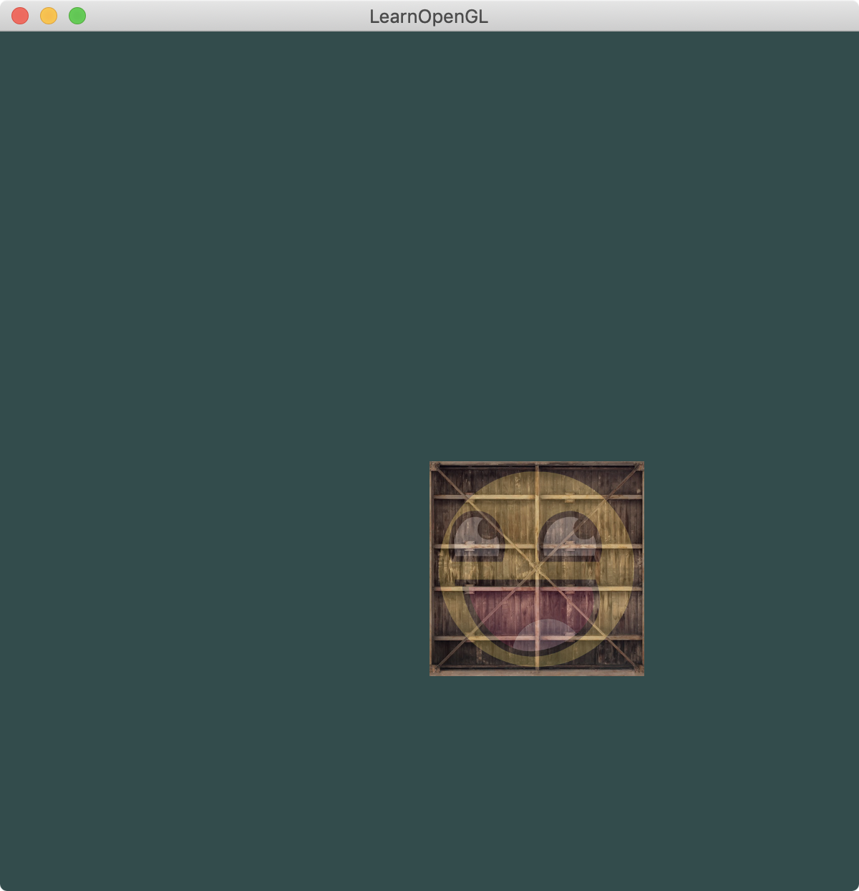
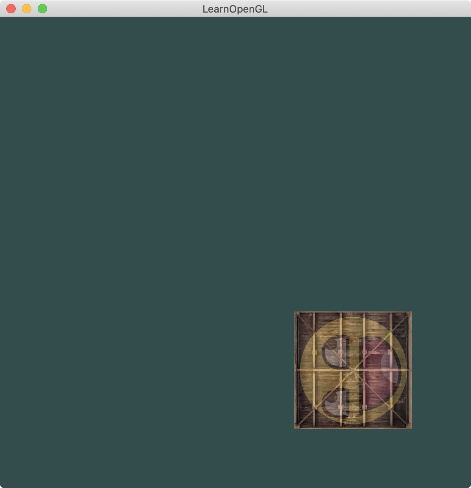
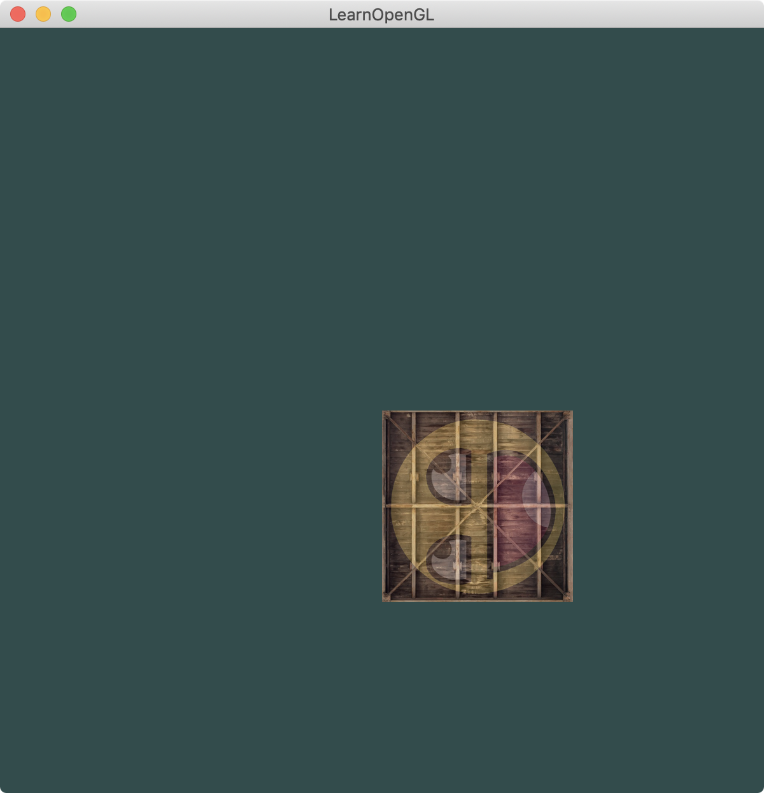

介绍：

参数：

```
物体位置 0 0 0
物体宽高 1x1   x:[-0.5, 0.5] y:[-0.5, 0.5]
窗口宽高 2x2   x:[-1, 1]     y:[-1, 1]

glm::vec3 trans(0.5f, -0.5f, 0.0f); // 平移，往右下角平移
float degress = 90.0f;              // 顺时针旋转90度
glm::vec3 axis(0, 0, 1);			// 旋转轴  （顺着z轴的正方向，顺时针旋转90度）
glm::vec3 scale(0.5f, 0.5f, 0.5f);  // 缩小一半
```


1.`__MODE_ROTATE_TRANS__`

旋转需要注意的是：**注意旋转的中心点**，不是按照平移后物体中心点为轴的，是**以初始时的物体中心点为原点**。

```
glm::mat4 method_rotate_trans(glm::vec3 trans, float degress, glm::vec3 axis) {
    std::cout << "变换矩阵 = 旋转*平移" << std::endl;
    glm::mat4 transform = glm::mat4(1.0f);

    transform = glm::rotate(transform, glm::radians(degress), axis);
    transform = glm::translate(transform, trans);

    std::cout << "对于ori顶点来说就是先平移后旋转" << std::endl;
    std::cout << "===============================" << std::endl;
    return transform;
}
```




2.`__MODE_TRANS_ROTATE_`

```
glm::mat4 method_trans_rotate(glm::vec3 trans, float degress, glm::vec3 axis) {
    std::cout << "变换矩阵 = 平移*旋转" << std::endl;
    glm::mat4 transform1 = glm::mat4(1.0f);

    transform1 = glm::translate(transform1, trans);
    transform1 = glm::rotate(transform1, glm::radians(degress), axis);

    std::cout << "对于ori顶点来说就是先旋转后平移" << std::endl;
    std::cout << "===============================" << std::endl;
    return transform1;
}
```




3.`__MODE_ROTATE_SCALE__`

旋转和缩放的先后顺序，对彼此都无影响

```
glm::mat4 method_rotate_scale(float degress, glm::vec3 axis, glm::vec3 scale) {
    std::cout << "变换矩阵 = 旋转*缩放" << std::endl;
    glm::mat4 transform1 = glm::mat4(1.0f);

    transform1 = glm::rotate(transform1, glm::radians(degress), axis);
    transform1 = glm::scale(transform1, scale);

    std::cout << "对于ori顶点来说就是先旋转后缩放" << std::endl;
    std::cout << "===============================" << std::endl;
    return transform1;
}
```




4.`__MODE_SCALE_ROTATE__`

旋转和缩放的先后顺序，对彼此都无影响

```
glm::mat4 method_scale_rotate(float degress, glm::vec3 axis, glm::vec3 scale) {
    std::cout << "变换矩阵 = 缩放*旋转" << std::endl;
    glm::mat4 transform1 = glm::mat4(1.0f);

    transform1 = glm::scale(transform1, scale);
    transform1 = glm::rotate(transform1, glm::radians(degress), axis);

    std::cout << "对于ori顶点来说就是先旋转后缩放" << std::endl;
    std::cout << "===============================" << std::endl;
    return transform1;
}
```


5.`__MODE_TRANS_SCALE__`

物体先scale再translate。由于物体先进行scale操作，scale已经生效，而后再进行translate，translate不会受scale影响，所以平移多少就是多少。

```
glm::mat4 method_trans_scale(glm::vec3 trans, glm::vec3 scale) {
    std::cout << "变换矩阵 = 平移*缩放" << std::endl;
    glm::mat4 transform1 = glm::mat4(1.0f);

    transform1 = glm::translate(transform1, trans);
    transform1 = glm::scale(transform1, scale);

    std::cout << "对于ori顶点来说就是先缩放后平移" << std::endl;
    std::cout << "===============================" << std::endl;
    return transform1;
}
```




6.`__MODE_SCALE_TRANS__`

物体先translate再scale。由于物体先进行translate操作，translate已经生效，在此基础上再进行scale操作，scale除了影响物体大小以外，还会影响translate，使得平移也被scale了。**[请看readme2.md的“矩阵的组合”一节]**

```
glm::mat4 method_scale_trans(glm::vec3 trans, glm::vec3 scale) {
    std::cout << "变换矩阵 = 缩放*平移" << std::endl;
    glm::mat4 transform1 = glm::mat4(1.0f);

    transform1 = glm::scale(transform1, scale);
    transform1 = glm::translate(transform1, trans);

    std::cout << "对于ori顶点来说就是先平移后缩放" << std::endl;
    std::cout << "===============================" << std::endl;
    return transform1;
}
```




7.`__MODE_TRANS_ROTATE_SCALE__`

```
glm::mat4 method_trans_rotate_scale(glm::vec3 trans, float degress, glm::vec3 axis, glm::vec3 scale) {
    std::cout << "变换矩阵 = 平移*旋转*缩放" << std::endl;
    glm::mat4 transform2 = glm::mat4(1.0f);

    transform2 = glm::translate(transform2, trans);
    transform2 = glm::rotate(transform2, glm::radians(degress), axis);
    transform2 = glm::scale(transform2, scale);

    std::cout << "对于ori顶点来说就是先缩放后旋转后平移" << std::endl;
    std::cout << "===============================" << std::endl;
    return transform2;
}
```




8.`__MODE_SCALE_TRANS_ROTATE__`

```
glm::mat4 method_scale_trans_rotate(glm::vec3 trans, float degress, glm::vec3 axis, glm::vec3 scale) {
    std::cout << "变换矩阵 = 缩放*平移*旋转" << std::endl;
    glm::mat4 transform2 = glm::mat4(1.0f);

    transform2 = glm::scale(transform2, scale);
    transform2 = glm::translate(transform2, trans);
    transform2 = glm::rotate(transform2, glm::radians(degress), axis);

    std::cout << "对于ori顶点来说就是先旋转后平移后缩放" << std::endl;
    std::cout << "===============================" << std::endl;

    return transform2;
}
```

