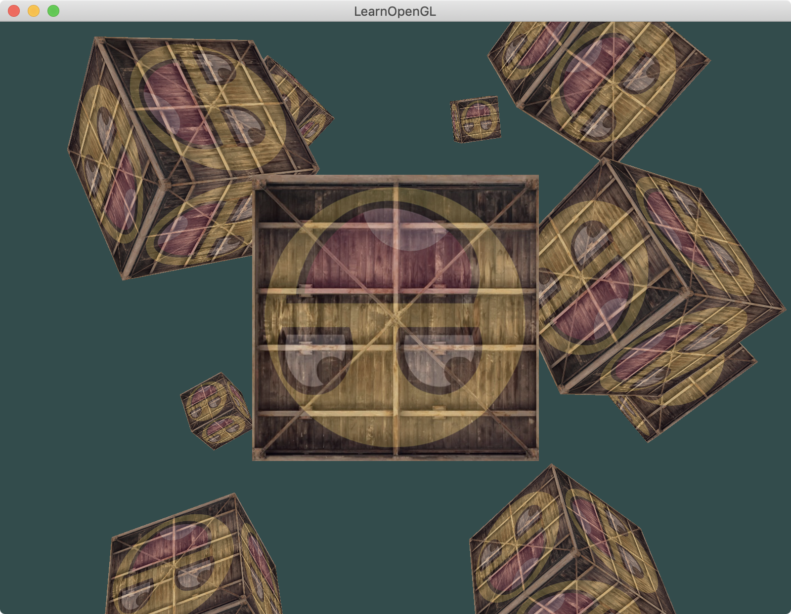

介绍：

在不同的位置绘制10个立方体。

与画一个立方体不同的地方就是for循环10次，调10次glDrawArrays。（shader只需要一个，VAO只需要一个）



### Simple code

```
while (!glfwWindowShouldClose(window))
{
	.....
    // render boxes
    glBindVertexArray(VAO);
    for (unsigned int i = 0; i < 10; i++)
    {
        glm::mat4 model = glm::mat4(1.0f);
        model = glm::translate(model, cubePositions[i]);
        float angle = 20.0f * i;
        model = glm::rotate(model, glm::radians(angle), glm::vec3(1.0f, 0.3f, 0.5f));
        ourShader.setMat4("model", model);

        glDrawArrays(GL_TRIANGLES, 0, 36);
    }
    ......
}
```

