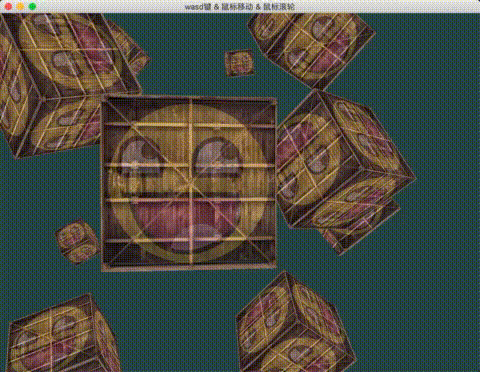

介绍：

绘制10个立方体，可以用键盘wasd控制移动，用鼠标移动控制方向，用鼠标滚轮控制视角。




### Simple code


鼠标移动：利用yaw，pitch

鼠标滚轮：利用fov


```
// camera
glm::vec3 cameraPos   = glm::vec3(0.0f, 0.0f, 3.0f);
glm::vec3 cameraFront = glm::vec3(0.0f, 0.0f, -1.0f);
glm::vec3 cameraUp    = glm::vec3(0.0f, 1.0f, 0.0f);

bool firstMouse = true;
float yaw   = -90.0f;	// yaw is initialized to -90.0 degrees since a yaw of 0.0 results in a direction vector pointing to the right so we initially rotate a bit to the left.
float pitch =  0.0f;
float lastX =  800.0f / 2.0;
float lastY =  600.0 / 2.0;
float fov   =  45.0f;

// timing
float deltaTime = 0.0f;	// time between current frame and last frame
float lastFrame = 0.0f;

glfwSetCursorPosCallback(window, mouse_callback);
glfwSetScrollCallback(window, scroll_callback);

while (!glfwWindowShouldClose(window))
{
    float currentFrame = glfwGetTime();
    deltaTime = currentFrame - lastFrame;
    lastFrame = currentFrame;
    
    ......
    
    glm::mat4 projection = glm::perspective(glm::radians(fov), (float)SCR_WIDTH / (float)SCR_HEIGHT, 0.1f, 100.0f);
    ourShader.setMat4("projection", projection);

	glm::mat4 view = glm::lookAt(cameraPos, cameraPos + cameraFront, cameraUp);
	ourShader.setMat4("view", view);
	
	......
}


// glfw: whenever the mouse moves, this callback is called
// -------------------------------------------------------
void mouse_callback(GLFWwindow* window, double xpos, double ypos)
{
    if (firstMouse)
    {
        lastX = xpos;
        lastY = ypos;
        firstMouse = false;
    }

    float xoffset = xpos - lastX;
    float yoffset = lastY - ypos; // reversed since y-coordinates go from bottom to top
    lastX = xpos;
    lastY = ypos;

    float sensitivity = 0.1f; // change this value to your liking
    xoffset *= sensitivity;
    yoffset *= sensitivity;

    yaw += xoffset;
    pitch += yoffset;

    // make sure that when pitch is out of bounds, screen doesn't get flipped
    if (pitch > 89.0f)
        pitch = 89.0f;
    if (pitch < -89.0f)
        pitch = -89.0f;

    glm::vec3 front;
    front.x = cos(glm::radians(yaw)) * cos(glm::radians(pitch));
    front.y = sin(glm::radians(pitch));
    front.z = sin(glm::radians(yaw)) * cos(glm::radians(pitch));
    cameraFront = glm::normalize(front);
}

// glfw: whenever the mouse scroll wheel scrolls, this callback is called
// ----------------------------------------------------------------------
void scroll_callback(GLFWwindow* window, double xoffset, double yoffset)
{
    if (fov >= 1.0f && fov <= 45.0f)
        fov -= yoffset;
    if (fov <= 1.0f)
        fov = 1.0f;
    if (fov >= 45.0f)
        fov = 45.0f;
}
```

