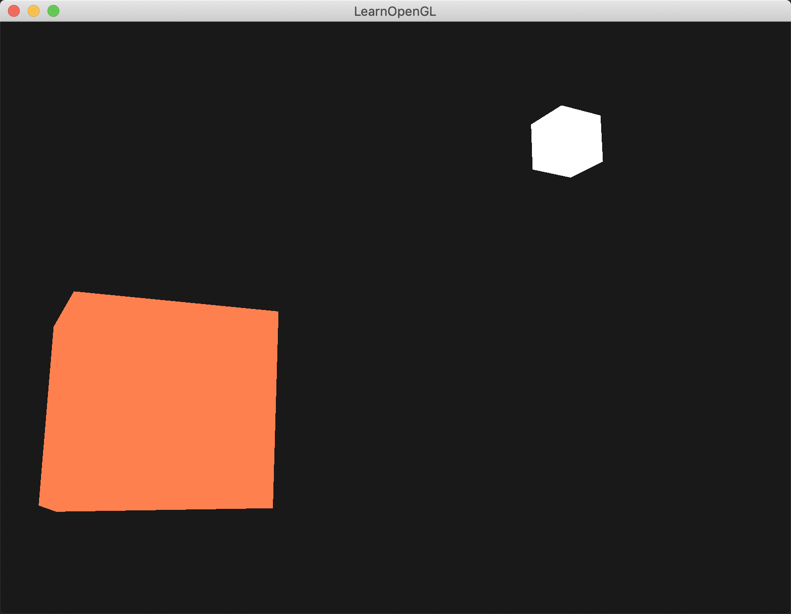

介绍：

绘制两个物体，（顶点数据只有一份，即vbo只有一份），有两个VAO。两个物体分别涂上不同的颜色。具体颜色见下：

第一个物体shader里有自己颜色数据，有light颜色数据，在shader里进行乘法计算。

```
lightingShader.use();
lightingShader.setVec3("objectColor", 1.0f, 0.5f, 0.31f);
lightingShader.setVec3("lightColor",  1.0f, 1.0f, 1.0f);
        
----------------------------------------------------------
#version 330 core
out vec4 FragColor;
  
uniform vec3 objectColor;
uniform vec3 lightColor;

void main()
{
    FragColor = vec4(lightColor * objectColor, 1.0);
}
```


第二个物体shader里写死自己的颜色。模拟光源|灯（lamp）。第二个物体有个scale和偏移量。

```
#version 330 core
out vec4 FragColor;

void main()
{
    FragColor = vec4(1.0); // set alle 4 vector values to 1.0
}
```





另外camera初始位置在

```
Camera camera(glm::vec3(0.0f, 0.0f, 3.0f));


// 设置投影矩阵
glm::mat4 projection = glm::perspective(glm::radians(camera.Zoom), (float)SCR_WIDTH / (float)SCR_HEIGHT, 0.1f, 100.0f);
glm::mat4 view = camera.GetViewMatrix(); // 获取camera/view矩阵
// 计算model矩阵
model = glm::mat4(1.0f);
model = glm::translate(model, lightPos);
model = glm::scale(model, glm::vec3(0.2f)); // a smaller cube

lampShader.setMat4("projection", projection);
lampShader.setMat4("view", view);
lampShader.setMat4("model", model);
```

