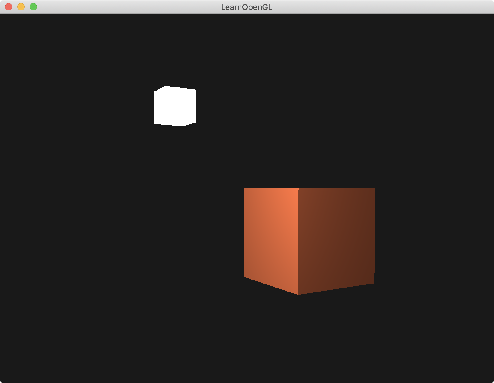

介绍ambient和diffuse光照：（环境光和漫反射光）

第一个物体在`(0,0,0)`，自己物体颜色为`(1.0f, 0.5f, 0.31f)`，光的颜色为`(1, 1, 1, 1)`，光的位置在`(1.2f, 1.0f, 2.0f)`。

第二个物体在`(1.2f, 1.0f, 2.0f)`位置上，该物体shader颜色写死，color为`(1, 1, 1, 1)`。充当灯lamp|光源。




### 顶点着色器的准备工作

顶点着色器需要将顶点数据传入片元着色器，注意：顶点数据是世界坐标系下的数据。

计算`FragPos`，并从顶点着色器传出。

```
#version 330 core
layout (location = 0) in vec3 aPos;
layout (location = 1) in vec3 aNormal;

out vec3 FragPos;
out vec3 Normal;

uniform mat4 model;
uniform mat4 view;
uniform mat4 projection;

void main()
{
    FragPos = vec3(model * vec4(aPos, 1.0));
    Normal = aNormal;  
    
    gl_Position = projection * view * vec4(FragPos, 1.0);
}
```


### 计算环境光ambient

环境光颜色`ambient` = 光的颜色`lightColor` * 环境光强度(系数)`ambientStrength`

```
// ambient
float ambientStrength = 0.1;
vec3 ambient = ambientStrength * lightColor;
```


### 计算漫反射光diffuse

1. 需要从顶点着色器传来法向量数据`Normal向量` （顶点着色的Normal数据是从cpu传过来的）
2. 在shader里单位化`Normal向量`，得到`norm向量`
3. 在shader里计算`点光源位置lightPos`与`当前顶点FragPos`的向量，并且单位化，得到`lightDir`。**该向量箭头指向lightPos（向量相减，箭头指向被减向量）**
4. 计算`norm向量`和`lightDir向量`的点积，若小于0，则取0，得到漫反射系数`diff`
5. 漫反射光颜色`diffuse` = 漫反射系数`diff` * 光照颜色`lightColor`

```
in vec3 Normal;  
in vec3 FragPos;

uniform vec3 lightPos; 
uniform vec3 lightColor;
uniform vec3 objectColor;

// diffuse 
vec3 norm = normalize(Normal);
vec3 lightDir = normalize(lightPos - FragPos);
float diff = max(dot(norm, lightDir), 0.0);
vec3 diffuse = diff * lightColor;
```


### 最终颜色

最终颜色`result` = 物体颜色`objectColor` * (环境光颜色`ambient` + 漫反射颜色`diffuse`)

 [**颜色相乘**]

```
vec3 result = (ambient + diffuse) * objectColor;
FragColor = vec4(result, 1.0);
```


### Simple Code

```
#version 330 core
out vec4 FragColor;

in vec3 Normal;  
in vec3 FragPos;  

uniform vec3 lightPos; 
uniform vec3 lightColor;
uniform vec3 objectColor;

void main()
{
    // ambient
    float ambientStrength = 0.1;
    vec3 ambient = ambientStrength * lightColor;
  	
    // diffuse 
    vec3 norm = normalize(Normal);
    vec3 lightDir = normalize(lightPos - FragPos);
    float diff = max(dot(norm, lightDir), 0.0);
    vec3 diffuse = diff * lightColor;
            
    vec3 result = (ambient + diffuse) * objectColor;
    FragColor = vec4(result, 1.0);
} 
```

```
float vertices[] = {
		// 顶点数据            // 法向量数据
        -0.5f, -0.5f, -0.5f,  0.0f,  0.0f, -1.0f,
         0.5f, -0.5f, -0.5f,  0.0f,  0.0f, -1.0f,
         0.5f,  0.5f, -0.5f,  0.0f,  0.0f, -1.0f,
         0.5f,  0.5f, -0.5f,  0.0f,  0.0f, -1.0f,
        -0.5f,  0.5f, -0.5f,  0.0f,  0.0f, -1.0f,
        -0.5f, -0.5f, -0.5f,  0.0f,  0.0f, -1.0f,
        
        .....
    };


......

glBindVertexArray(cubeVAO);

glBindBuffer(GL_ARRAY_BUFFER, VBO);
glBufferData(GL_ARRAY_BUFFER, sizeof(vertices), vertices, GL_STATIC_DRAW);

// position attribute // 指定顶点数据
glVertexAttribPointer(0, 3, GL_FLOAT, GL_FALSE, 6 * sizeof(float), (void*)0);
glEnableVertexAttribArray(0);
// normal attribute // 指定法向量数据  
glVertexAttribPointer(1, 3, GL_FLOAT, GL_FALSE, 6 * sizeof(float), (void*)(3 * sizeof(float)));
glEnableVertexAttribArray(1);
```

