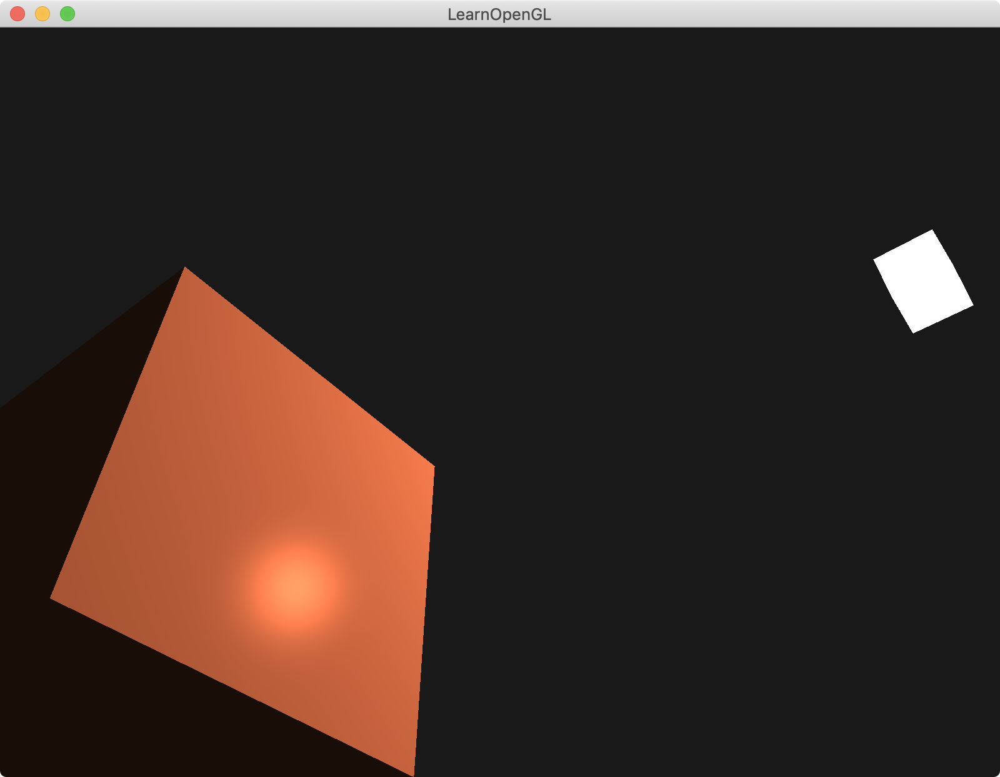

介绍镜面光specular：

第一个物体在`(0,0,0)`，自己物体颜色为`(1.0f, 0.5f, 0.31f)`，光的颜色为`(1, 1, 1, 1)`，光的位置在`(1.2f, 1.0f, 2.0f)`。

第二个物体在`(1.2f, 1.0f, 2.0f)`位置上，该物体shader颜色写死，color为`(1, 1, 1, 1)`。充当灯lamp|光源。

在第一个物体上，除了ambient和diffuse光影响外，本demo加了specular光。




### 顶点着色器的准备工作

当model进行旋转rotate和不等比缩放scale时，法向量的方向就会发生变化，这时需要法线矩阵（Normal Matrix）。

法线矩阵被定义为「模型矩阵左上角的逆矩阵的转置矩阵」: `transpose(inverse(model))`

```
#version 330 core
layout (location = 0) in vec3 aPos;
layout (location = 1) in vec3 aNormal;

out vec3 FragPos;
out vec3 Normal;

uniform mat4 model;
uniform mat4 view;
uniform mat4 projection;

void main()
{
    Normal = mat3(transpose(inverse(model))) * aNormal;  
    FragPos = vec3(model * vec4(aPos, 1.0));    

    gl_Position = projection * view * vec4(FragPos, 1.0);
}
```


### 计算镜面光specular

1. 初始化镜面光强度`specularStrength`
2. 计算出顶点`FragPos`到摄像机`viewPos`的视角向量`viewDir`，并单位化
3. 通过顶点`FragPos`到光源`lightPos`的单位向量`lightDir` 和 法向量`norm`，计算出反射向量reflectDir
4. 反射向量reflectDir和视角向量viewDir的点积，小于0取0；取该值的32次幂，得到镜面光系数spec
5. 镜面光颜色 = 镜面光强度specularStrength * 镜面光系数spec * 光照颜色lightColor
6. 最后 （环境光颜色 + 漫反射光颜色 + 镜面光颜色） * 物体颜色，就是最终颜色值

```
#version 330 core
out vec4 FragColor;

in vec3 Normal;  
in vec3 FragPos;  
  
uniform vec3 lightPos; 
uniform vec3 viewPos; 
uniform vec3 lightColor;
uniform vec3 objectColor;

void main()
{
    // ambient
    float ambientStrength = 0.1;
    vec3 ambient = ambientStrength * lightColor;
  	
    // diffuse 
    vec3 norm = normalize(Normal);
    vec3 lightDir = normalize(lightPos - FragPos);
    float diff = max(dot(norm, lightDir), 0.0);
    vec3 diffuse = diff * lightColor;
    
    // specular
    float specularStrength = 0.5;
    vec3 viewDir = normalize(viewPos - FragPos);
    vec3 reflectDir = reflect(-lightDir, norm);  
    float spec = pow(max(dot(viewDir, reflectDir), 0.0), 32);
    vec3 specular = specularStrength * spec * lightColor;  
        
    vec3 result = (ambient + diffuse + specular) * objectColor;
    FragColor = vec4(result, 1.0);
} 
```

