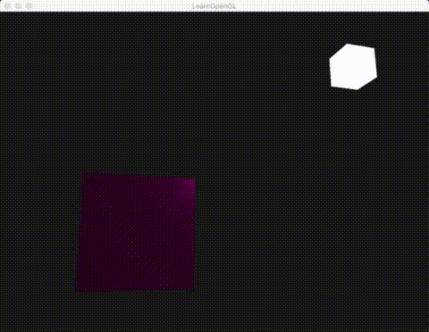

介绍：

第一个物体位置在`(0,0,0)`，光的位置在`(1.2f, 1.0f, 2.0f)`。

第二个物体在`(1.2f, 1.0f, 2.0f)`位置上，该物体shader颜色写死，color为`(1, 1, 1, 1)`。充当灯lamp|光源。

第一个物体自身有材质结构体，含有ambient，diffuse，specular和shininess；

光的结构体含有ambient，diffuse，specular和position。

第一个物体在自身材质和光材质的组合下，颜色不停得随时间变化而变化。




### Simple code

shader里创建结构体`struct`.

最终颜色值由**ambient + diffuse + specular**组成。

各个分量都由物体材质和光材质**复合**而成:

​	ambient = light.ambient * material.ambient

​	diffuse = light.diffuse * material.diffuse * diff

​	spacular = light.spacular * material.spacular * spac

```
#version 330 core
out vec4 FragColor;

struct Material {
    vec3 ambient;
    vec3 diffuse;
    vec3 specular;    
    float shininess;
}; 

struct Light {
    vec3 position;

    vec3 ambient;
    vec3 diffuse;
    vec3 specular;
};

in vec3 FragPos;  
in vec3 Normal;  
  
uniform vec3 viewPos;
uniform Material material;   // 没有glUniformMaterial,直接往Material结构体里传值即可
uniform Light light;         // 没有glUniformLight,直接往Light结构体里传值即可

void main()
{
    // ambient
    vec3 ambient = light.ambient * material.ambient;
  	
    // diffuse 
    vec3 norm = normalize(Normal);
    vec3 lightDir = normalize(light.position - FragPos);
    float diff = max(dot(norm, lightDir), 0.0);
    vec3 diffuse = light.diffuse * (diff * material.diffuse);
    
    // specular
    vec3 viewDir = normalize(viewPos - FragPos);
    vec3 reflectDir = reflect(-lightDir, norm);  
    float spec = pow(max(dot(viewDir, reflectDir), 0.0), material.shininess);
    vec3 specular = light.specular * (spec * material.specular);  
        
    vec3 result = ambient + diffuse + specular;
    FragColor = vec4(result, 1.0);
} 

--------------------------------------------------------------------------------------------

#version 330 core
layout (location = 0) in vec3 aPos;
layout (location = 1) in vec3 aNormal;

out vec3 FragPos;
out vec3 Normal;

uniform mat4 model;
uniform mat4 view;
uniform mat4 projection;

void main()
{
    FragPos = vec3(model * vec4(aPos, 1.0));
    Normal = mat3(transpose(inverse(model))) * aNormal;  
    
    gl_Position = projection * view * vec4(FragPos, 1.0);
}

--------------------------------------------------------------------------------------------

glm::vec3 lightColor;
lightColor.x = sin(glfwGetTime() * 2.0f);
lightColor.y = sin(glfwGetTime() * 0.7f);
lightColor.z = sin(glfwGetTime() * 1.3f);
glm::vec3 diffuseColor = lightColor   * glm::vec3(0.5f); // decrease the influence
glm::vec3 ambientColor = diffuseColor * glm::vec3(0.2f); // low influence

// 直接往结构体里的数据传值即可
lightingShader.use();
lightingShader.setVec3("light.position", lightPos);
lightingShader.setVec3("viewPos", camera.Position);
lightingShader.setVec3("light.ambient", ambientColor);
lightingShader.setVec3("light.diffuse", diffuseColor);
lightingShader.setVec3("light.specular", 1.0f, 1.0f, 1.0f);
lightingShader.setVec3("material.ambient", 1.0f, 0.5f, 0.31f);
lightingShader.setVec3("material.diffuse", 1.0f, 0.5f, 0.31f);
lightingShader.setVec3("material.specular", 0.5f, 0.5f, 0.5f); // specular lighting doesn't have full effect on this object's material
lightingShader.setFloat("material.shininess", 32.0f);
```