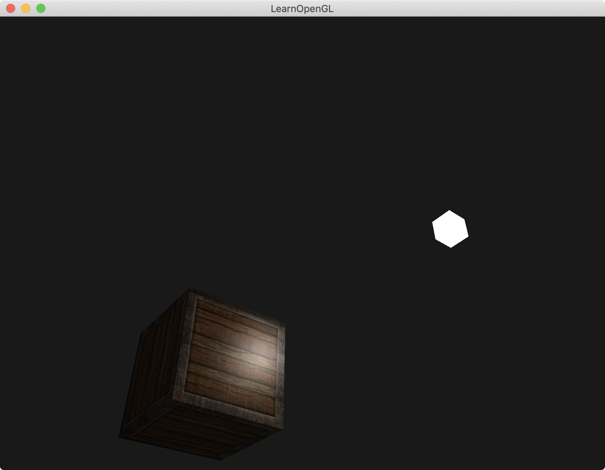

介绍：

第一个物体位置在`(0,0,0)`，光的位置在`(1.2f, 1.0f, 2.0f)`。

第二个物体在`(1.2f, 1.0f, 2.0f)`位置上，该物体shader颜色写死，color为`(1, 1, 1, 1)`。充当灯lamp|光源。

第一个物体加了纹理材质。




### Simple code

着色器里的Material结构体中添加了`smapler2D diffuse`

那么material的diffuse就变成了`texture(material.diffuse, TexCoords).rgb`

```
#version 330 core
out vec4 FragColor;

struct Material {
    sampler2D diffuse;
    vec3 specular;    
    float shininess;
}; 

struct Light {
    vec3 position;

    vec3 ambient;
    vec3 diffuse;
    vec3 specular;
};

in vec3 FragPos;  
in vec3 Normal;  
in vec2 TexCoords;
  
uniform vec3 viewPos;
uniform Material material;
uniform Light light;

void main()
{
    // ambient
    vec3 ambient = light.ambient * texture(material.diffuse, TexCoords).rgb;
  	
    // diffuse 
    vec3 norm = normalize(Normal);
    vec3 lightDir = normalize(light.position - FragPos);
    float diff = max(dot(norm, lightDir), 0.0);
    vec3 diffuse = light.diffuse * diff * texture(material.diffuse, TexCoords).rgb;  
    
    // specular
    vec3 viewDir = normalize(viewPos - FragPos);
    vec3 reflectDir = reflect(-lightDir, norm);  
    float spec = pow(max(dot(viewDir, reflectDir), 0.0), material.shininess);
    vec3 specular = light.specular * (spec * material.specular);  
        
    vec3 result = ambient + diffuse + specular;
    FragColor = vec4(result, 1.0);
} 
```

cpu要给shader里Material结构体中的smapler2D传值

```
// 加载texture，生成textureId
unsigned int diffuseMapTextureID = loadTexture(FileSystem::getPath("resources/textures/container2.png").c_str());

// 给shader的Material结构体中的smapler2D传值
lightingShader.use(); 
lightingShader.setInt("material.diffuse", 0);

while (!glfwWindowShouldClose(window))
{
    ......
    
    // bind diffuse map
    glActiveTexture(GL_TEXTURE0);
    glBindTexture(GL_TEXTURE_2D, diffuseMapTextureID);
    
    ......
}
```

生成Texture ID

```
// utility function for loading a 2D texture from file
// ---------------------------------------------------
unsigned int loadTexture(char const * path)
{
    unsigned int textureID;
    glGenTextures(1, &textureID);
    
    int width, height, nrComponents;
    unsigned char *data = stbi_load(path, &width, &height, &nrComponents, 0);
    if (data)
    {
        GLenum format;
        if (nrComponents == 1)
            format = GL_RED;
        else if (nrComponents == 3)
            format = GL_RGB;
        else if (nrComponents == 4)
            format = GL_RGBA;

        glBindTexture(GL_TEXTURE_2D, textureID);
        glTexImage2D(GL_TEXTURE_2D, 0, format, width, height, 0, format, GL_UNSIGNED_BYTE, data);
        glGenerateMipmap(GL_TEXTURE_2D);

        glTexParameteri(GL_TEXTURE_2D, GL_TEXTURE_WRAP_S, GL_REPEAT);
        glTexParameteri(GL_TEXTURE_2D, GL_TEXTURE_WRAP_T, GL_REPEAT);
        glTexParameteri(GL_TEXTURE_2D, GL_TEXTURE_MIN_FILTER, GL_LINEAR_MIPMAP_LINEAR);
        glTexParameteri(GL_TEXTURE_2D, GL_TEXTURE_MAG_FILTER, GL_LINEAR);

        stbi_image_free(data);
    }
    else
    {
        std::cout << "Texture failed to load at path: " << path << std::endl;
        stbi_image_free(data);
    }

    return textureID;
}
```

