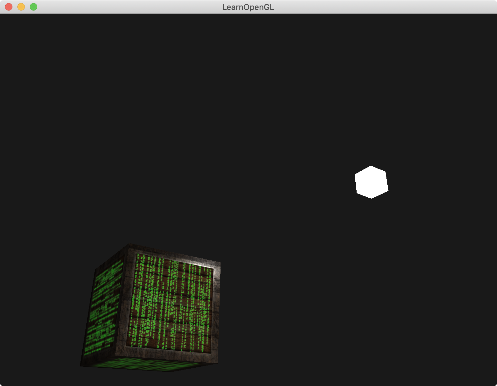

介绍：

第一个物体位置在`(0,0,0)`，光的位置在`(1.2f, 1.0f, 2.0f)`。

第二个物体在`(1.2f, 1.0f, 2.0f)`位置上，该物体shader颜色写死，color为`(1, 1, 1, 1)`。充当灯lamp|光源。

第一个物体加了三个纹理材质，一个diffuse纹理，一个specular纹理，一个emission纹理。

emission纹理：


结果图：





### Simple code

1. 着色器里的Material结构体中添加了`smapler2D diffuse`，那么material的diffuse就变成了`texture(material.diffuse, TexCoords).rgb`
2. 着色器里的Material结构体中添加了`smapler2D spacular`，那么material的spacular就变成了`texture(material.specular, TexCoords).rgb`
3. 着色器里的Material结构体中添加了`smapler2D emission`，那么material的emission就变成了`texture(material.emission, TexCoords).rgb`

```
#version 330 core
out vec4 FragColor;

struct Material {
    sampler2D diffuse;
    sampler2D specular;    
    sampler2D emission;
    float shininess;
}; 

struct Light {
    vec3 position;

    vec3 ambient;
    vec3 diffuse;
    vec3 specular;
};

in vec3 FragPos;  
in vec3 Normal;  
in vec2 TexCoords;
  
uniform vec3 viewPos;
uniform Material material;
uniform Light light;

void main()
{
    // ambient
    vec3 ambient = light.ambient * texture(material.diffuse, TexCoords).rgb;
  	
    // diffuse 
    vec3 norm = normalize(Normal);
    vec3 lightDir = normalize(light.position - FragPos);
    float diff = max(dot(norm, lightDir), 0.0);
    vec3 diffuse = light.diffuse * diff * texture(material.diffuse, TexCoords).rgb;  
    
    // specular
    vec3 viewDir = normalize(viewPos - FragPos);
    vec3 reflectDir = reflect(-lightDir, norm);  
    float spec = pow(max(dot(viewDir, reflectDir), 0.0), material.shininess);
    vec3 specular = light.specular * spec * texture(material.specular, TexCoords).rgb;  
    
    // emission
    vec3 emission = texture(material.emission, TexCoords).rgb;
        
    vec3 result = ambient + diffuse + specular + emission;
    FragColor = vec4(result, 1.0);
} 

--------------------------------------------------------------------------------


// 加载两张纹理，生成3个纹理Id
unsigned int diffuseMap = loadTexture(FileSystem::getPath("resources/textures/container2.png").c_str());
unsigned int specularMap = loadTexture(FileSystem::getPath("resources/textures/container2_specular.png").c_str());
unsigned int emissionMap = loadTexture(FileSystem::getPath("resources/textures/matrix.jpg").c_str());

// 将纹理Id传给shader
lightingShader.use();
lightingShader.setInt("material.diffuse", 0);
lightingShader.setInt("material.specular", 1);
lightingShader.setInt("material.emission", 2);

while (!glfwWindowShouldClose(window))
{
	......
	
	// bind diffuse map
    glActiveTexture(GL_TEXTURE0);
    glBindTexture(GL_TEXTURE_2D, diffuseMap);
    // bind specular map
    glActiveTexture(GL_TEXTURE1);
    glBindTexture(GL_TEXTURE_2D, specularMap);
    glActiveTexture(GL_TEXTURE2);
    glBindTexture(GL_TEXTURE_2D, emissionMap);
    
    ......
}
```

