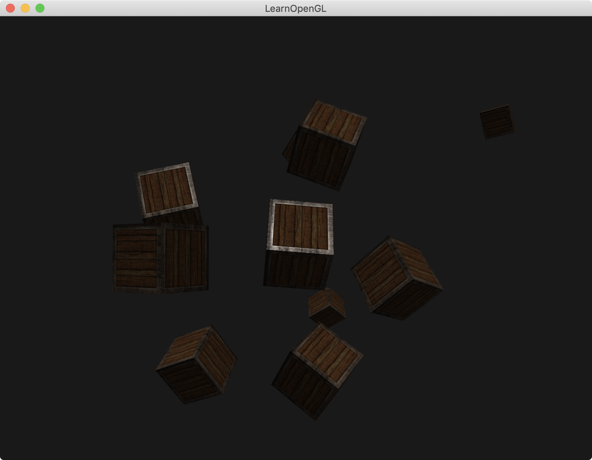

介绍：

绘制10个物体。

将**点光源**换为**平行光源**。以前**点光源位置**在`(1.2f, 1.0f, 2.0f)`，现在**平行光源方向**为`(-0.2f, -1.0f, -0.3f)`





### Simple code

1. Light结构体添加vec3 direction
2. 计算光的方向由`normalize(light.position - FragPos)`变为`normalize(-light.direction)`

```
#version 330 core
out vec4 FragColor;

struct Material {
    sampler2D diffuse;
    sampler2D specular;    
    float shininess;
}; 

struct Light {
    //vec3 position;
    vec3 direction;

    vec3 ambient;
    vec3 diffuse;
    vec3 specular;
};

in vec3 FragPos;  
in vec3 Normal;  
in vec2 TexCoords;

uniform vec3 viewPos;
uniform Material material;
uniform Light light;

void main()
{
    // ambient
    vec3 ambient = light.ambient * texture(material.diffuse, TexCoords).rgb;
  	
    // diffuse 
    vec3 norm = normalize(Normal);
    // vec3 lightDir = normalize(light.position - FragPos);
    vec3 lightDir = normalize(-light.direction);  
    float diff = max(dot(norm, lightDir), 0.0);
    vec3 diffuse = light.diffuse * diff * texture(material.diffuse, TexCoords).rgb;  
    
    // specular
    vec3 viewDir = normalize(viewPos - FragPos);
    vec3 reflectDir = reflect(-lightDir, norm);  
    float spec = pow(max(dot(viewDir, reflectDir), 0.0), material.shininess);
    vec3 specular = light.specular * spec * texture(material.specular, TexCoords).rgb;  
        
    vec3 result = ambient + diffuse + specular;
    FragColor = vec4(result, 1.0);
} 
```

