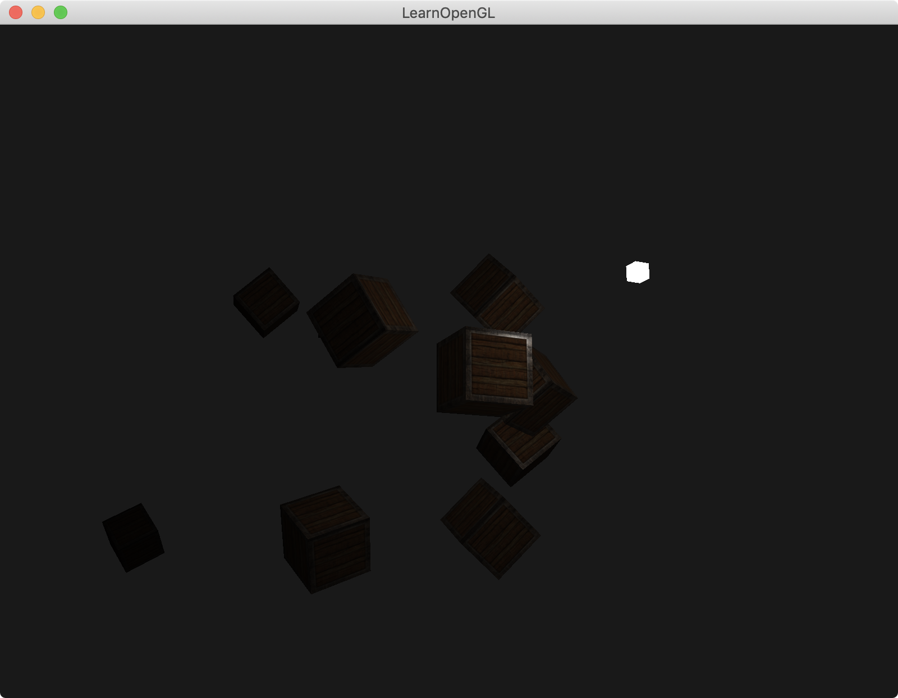

介绍：

绘制10个物体，光源为点光源，位置在`(1.2f, 1.0f, 2.0f)`

物体离点光源越近，则越亮；物体离点光源越远，则越暗。




### Simple code

计算**衰减系数**`attenuation`

给定常量系数constant，线性系数linear以及二次方系数quadratic；

衰减系数`attenuation` 等于 1 除以 （constant + linear * 距离 + quadratic * 距离 * 距离）

即`attenuation = 1.0 / (constant + linear * distance + quadratic * (distance * distance));`

计算出衰减系数后，依次与ambient，diffuse和specular相乘

```
#version 330 core
out vec4 FragColor;

struct Material {
    sampler2D diffuse;
    sampler2D specular;    
    float shininess;
}; 

struct Light {
    vec3 position;  
  
    vec3 ambient;
    vec3 diffuse;
    vec3 specular;
	
    float constant;
    float linear;
    float quadratic;
};

in vec3 FragPos;  
in vec3 Normal;  
in vec2 TexCoords;
  
uniform vec3 viewPos;
uniform Material material;
uniform Light light;

void main()
{
    // ambient
    vec3 ambient = light.ambient * texture(material.diffuse, TexCoords).rgb;
  	
    // diffuse 
    vec3 norm = normalize(Normal);
    vec3 lightDir = normalize(light.position - FragPos);
    float diff = max(dot(norm, lightDir), 0.0);
    vec3 diffuse = light.diffuse * diff * texture(material.diffuse, TexCoords).rgb;  
    
    // specular
    vec3 viewDir = normalize(viewPos - FragPos);
    vec3 reflectDir = reflect(-lightDir, norm);  
    float spec = pow(max(dot(viewDir, reflectDir), 0.0), material.shininess);
    vec3 specular = light.specular * spec * texture(material.specular, TexCoords).rgb;  
    
    // attenuation
    float distance    = length(light.position - FragPos);
    float attenuation = 1.0 / (light.constant + light.linear * distance + light.quadratic * (distance * distance));    

    ambient  *= attenuation;  
    diffuse  *= attenuation;
    specular *= attenuation;   
        
    vec3 result = ambient + diffuse + specular;
    FragColor = vec4(result, 1.0);
} 

------------------------------------------------------------------------------------

lightingShader.setFloat("light.constant", 1.0f);
lightingShader.setFloat("light.linear", 0.09f);
lightingShader.setFloat("light.quadratic", 0.032f);
```

