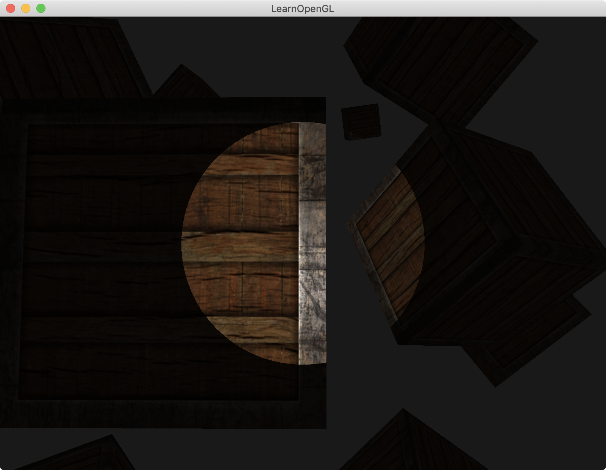
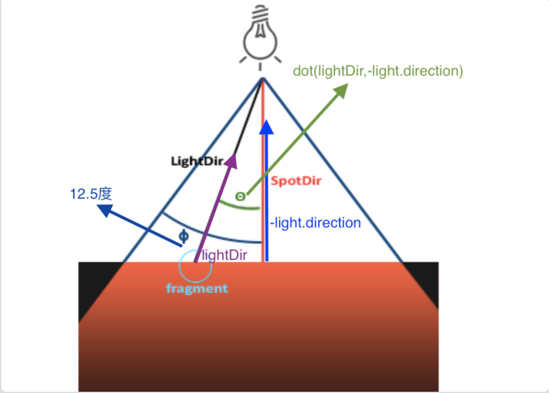

介绍：

画10个物体。

实现聚光灯效果。该灯左右夹角为12.5*2度。




### 聚光灯实现原理



1. light.cutOff = glm::cos(glm::radians(12.5f))  12.5度的cos值
2. lightDir = normalize(light.position - FragPos)     当前顶点到点光源位置的向量
3. light.direction = camera.Front    聚光灯照射方向的正中心单位向量，等于camera的front向量
4. 计算当前顶点与光源顶点的夹角的cos值：`float theta = dot(lightDir, normalize(-light.direction)); `（**当前顶点到点光源位置的向量** 和 **聚光灯照射方向的正中心单位向量** 的点积）
5. 若上一步计算的值 > light.cutOff，则绘制光照；否则只进行环境光的加成

```
#version 330 core
out vec4 FragColor;

struct Material {
    sampler2D diffuse;
    sampler2D specular;    
    float shininess;
}; 

struct Light {
    vec3 position;  
    vec3 direction;
    float cutOff;

    vec3 ambient;
    vec3 diffuse;
    vec3 specular;
	
    float constant;
    float linear;
    float quadratic;
};

in vec3 FragPos;  
in vec3 Normal;  
in vec2 TexCoords;
  
uniform vec3 viewPos;
uniform Material material;
uniform Light light;

void main()
{
    vec3 lightDir = normalize(light.position - FragPos);
    
    // check if lighting is inside the spotlight cone
    float theta = dot(lightDir, normalize(-light.direction)); 
    
    if(theta > light.cutOff) // remember that we're working with angles as cosines instead of degrees so a '>' is used.
    {    
        // ambient
        vec3 ambient = light.ambient * texture(material.diffuse, TexCoords).rgb;
        
        // diffuse 
        vec3 norm = normalize(Normal);
        float diff = max(dot(norm, lightDir), 0.0);
        vec3 diffuse = light.diffuse * diff * texture(material.diffuse, TexCoords).rgb;  
        
        // specular
        vec3 viewDir = normalize(viewPos - FragPos);
        vec3 reflectDir = reflect(-lightDir, norm);  
        float spec = pow(max(dot(viewDir, reflectDir), 0.0), material.shininess);
        vec3 specular = light.specular * spec * texture(material.specular, TexCoords).rgb;  
        
        // attenuation
        float distance    = length(light.position - FragPos);
        float attenuation = 1.0 / (light.constant + light.linear * distance + light.quadratic * (distance * distance));    

        // ambient  *= attenuation; // remove attenuation from ambient, as otherwise at large distances the light would be darker inside than outside the spotlight due the ambient term in the else branche
        diffuse   *= attenuation;
        specular *= attenuation;   
            
        vec3 result = ambient + diffuse + specular;
        FragColor = vec4(result, 1.0);
    }
    else 
    {
        // else, use ambient light so scene isn't completely dark outside the spotlight.
        FragColor = vec4(light.ambient * texture(material.diffuse, TexCoords).rgb, 1.0);
    }
} 
```

