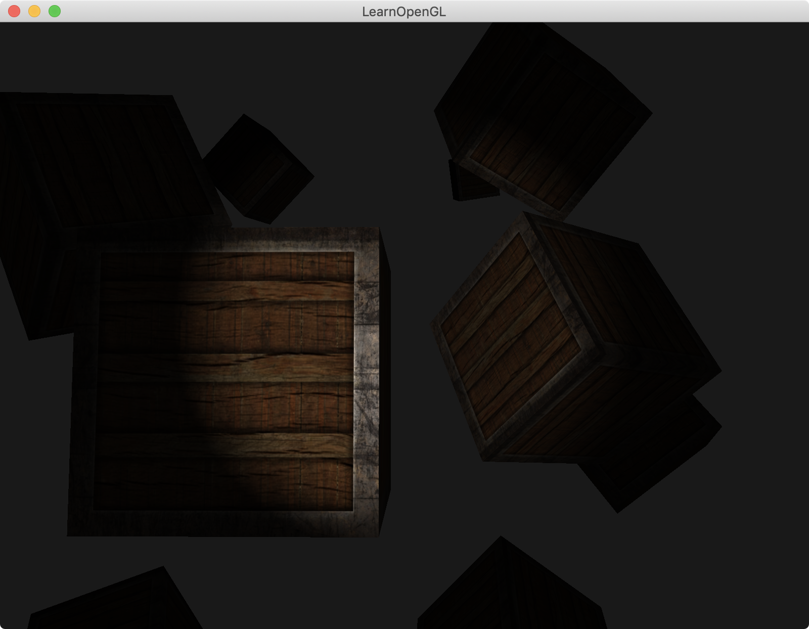

介绍：

画10个物体。

实现聚光灯效果。该灯**完全照明角度**为12.5\*2度，**柔和照明角度**为(17.5-12.5)\*2度。聚光灯边缘效果更为柔和。




### 聚光灯柔和效果实现原理

clamp(x, min, max) 含义：若x>max则取max，若x<min则取min，否则取x。min(max(x, min), max)。

1. 计算当前顶点与光源顶点的夹角的cos值：`float theta = dot(lightDir, normalize(-light.direction)); `（**当前顶点到点光源位置的向量** 和 **聚光灯照射方向的正中心单位向量** 的点积）
2. 计算柔和角度的cos值`float epsilon = (light.cutOff - light.outerCutOff);`
3. 设`float intensity = clamp((theta - light.outerCutOff) / epsilon, 0.0, 1.0);`。当**当前顶点**和**光源顶点**的夹角越大，则theta越小。当theta > cutOff时，说明当前顶点在聚光灯**完全照亮**的内部，`(theta - light.outerCutOff) / epsilon`该值算出来大于1，clamp之后intensity为1；当outerCutOff < theta < cutOff时，说明当前顶点在聚光灯**柔和照亮**的内部，`(theta - light.outerCutOff) / epsilon`该值算出来在0到1之间，clamp之后intensity为0到1之间的一个值；当theta < outerCutOff时，说明当前顶点在聚光灯**柔和照亮**的外部，`(theta - light.outerCutOff) / epsilon`该值小于0，clamp之后intensity为0。
4. 漫反射光diffuse和镜面光specular分别乘以刚刚的intensity值，即可实现聚光灯柔和效果。

```
#version 330 core
out vec4 FragColor;

struct Material {
    sampler2D diffuse;
    sampler2D specular;    
    float shininess;
}; 

struct Light {
    vec3 position;  
    vec3 direction;
    float cutOff;
    float outerCutOff;
  
    vec3 ambient;
    vec3 diffuse;
    vec3 specular;
	
    float constant;
    float linear;
    float quadratic;
};

in vec3 FragPos;  
in vec3 Normal;  
in vec2 TexCoords;
  
uniform vec3 viewPos;
uniform Material material;
uniform Light light;

void main()
{
    // ambient
    vec3 ambient = light.ambient * texture(material.diffuse, TexCoords).rgb;
    
    // diffuse 
    vec3 norm = normalize(Normal);
    vec3 lightDir = normalize(light.position - FragPos);
    float diff = max(dot(norm, lightDir), 0.0);
    vec3 diffuse = light.diffuse * diff * texture(material.diffuse, TexCoords).rgb;  
    
    // specular
    vec3 viewDir = normalize(viewPos - FragPos);
    vec3 reflectDir = reflect(-lightDir, norm);  
    float spec = pow(max(dot(viewDir, reflectDir), 0.0), material.shininess);
    vec3 specular = light.specular * spec * texture(material.specular, TexCoords).rgb;  
    
    // spotlight (soft edges)
    float theta = dot(lightDir, normalize(-light.direction)); 
    float epsilon = (light.cutOff - light.outerCutOff);
    float intensity = clamp((theta - light.outerCutOff) / epsilon, 0.0, 1.0);
    diffuse  *= intensity;
    specular *= intensity;
    
    // attenuation
    float distance    = length(light.position - FragPos);
    float attenuation = 1.0 / (light.constant + light.linear * distance + light.quadratic * (distance * distance));    
    ambient  *= attenuation; 
    diffuse   *= attenuation;
    specular *= attenuation;   
        
    vec3 result = ambient + diffuse + specular;
    FragColor = vec4(result, 1.0);
} 
```

