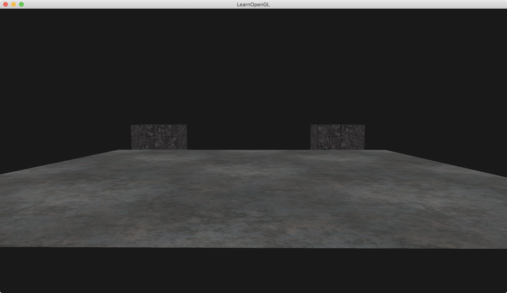
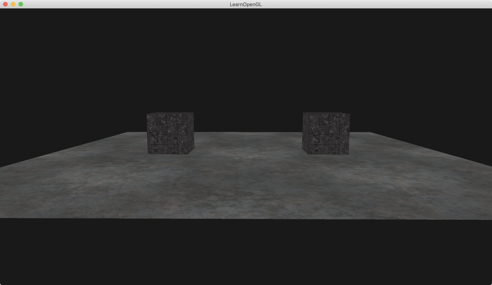

介绍：

绘制一个地面plane，位置在`(0,0,0)`，由于顶点数据中y轴都为-0.5f，则该地面plane看起来在y为-1的平面上，长宽为10x10。即该地面看起来在`(0, -1, 0)`的位置上，x方向长度为10，z方向长度为10.

绘制两个箱子cube，一个位置在(-2, 0, 0)，另一个位置在(2, 0, 0)。两个立方体箱子为1x1x1的箱子。

本Demo只使用了一个shader。

注意：本Demo绘制顺序是先绘制两个cube，再绘制plane。

`__MODE_ALWAYS__`:

由于先画两个cube，再画plane，由于depth mode是GL_ALWAYS，这意味着后画的物体永远是通过深度检测，则谁后画，就优先能看到。




`__MODE_LESS__`:

GL_LESS：指定谁深度小绘制谁。这种检测情况下，跟绘制顺序对深度无影响。




### Simple code

```
    glEnable(GL_DEPTH_TEST);
#ifdef __MODE_ALWAYS__
    glDepthFunc(GL_ALWAYS);
#endif
#ifdef __MODE_LESS__
    glDepthFunc(GL_LESS);
#endif

```

