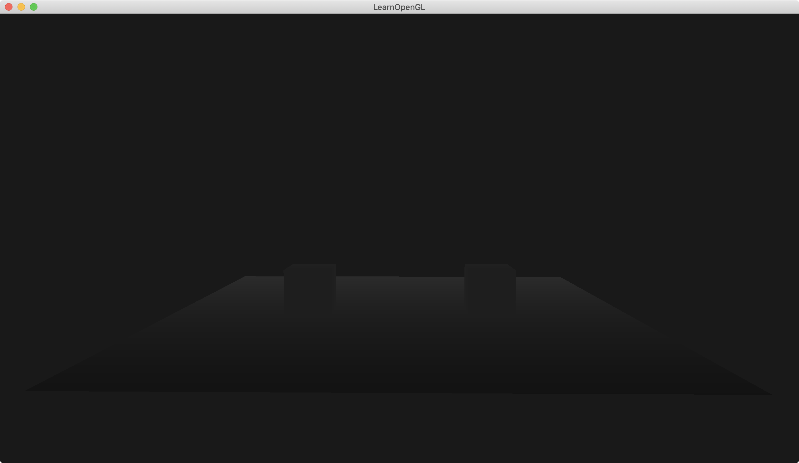

介绍：

将深度信息可视化。

绘制一个地面plane，位置在`(0,0,0)`，由于顶点数据中y轴都为-0.5f，则该地面plane看起来在y为-1的平面上，长宽为10x10。即该地面看起来在`(0, -1, 0)`的位置上，x方向长度为10，z方向长度为10.

绘制两个箱子cube，一个位置在(-2, 0, 0)，另一个位置在(2, 0, 0)。两个立方体箱子为1x1x1的箱子。

本Demo只使用了一个shader。

注意：本Demo绘制顺序是先绘制两个cube，再绘制plane。

depth的模式为GL_LESS。




### Simple code

NDC: 标准化设备坐标空间（Normalized Device Coordinates，NDC）

NDC 坐标空间范围在 X 轴，Y 轴和 Z 轴都是 [-1, 1]

窗口深度坐标的范围是 [0, 1] ，即`gl_FragCoord.z`的范围是[0, 1]. `gl_FragCoord.z * 2 -1`就转化为NDC坐标了

```
#version 330 core
out vec4 FragColor;

float near = 0.1; 
float far = 100.0; 
float LinearizeDepth(float depth) 
{
    float z = depth * 2.0 - 1.0; // back to NDC 
    return (2.0 * near * far) / (far + near - z * (far - near));	
}

void main()
{             
    float depth = LinearizeDepth(gl_FragCoord.z) / far; // divide by far to get depth in range [0,1] for visualization purposes
    FragColor = vec4(vec3(depth), 1.0);
}
```

