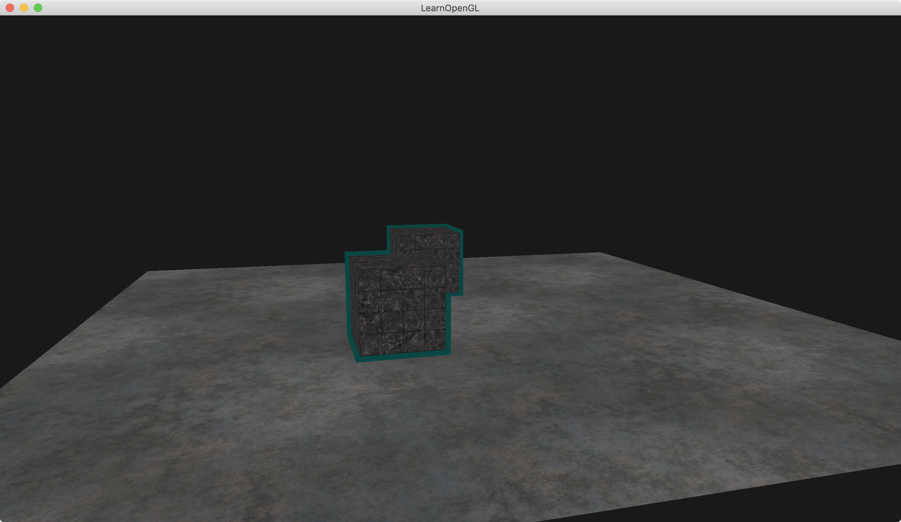

介绍：

stencil模版检测。利用模版缓冲（stencil buffer）实现高亮物体轮廓。

画一个地板，地板上画两个立方体物体，物体能高亮。




### Simple code

glStencilMask(0xFF): 表示模版缓冲可写

glStencilMask(0x00): 表示模版缓冲不可写

glStencilFunc表示测试的方法，glStencilOp表示测试成功后，写入缓冲区应该取什么值。

绘制技巧，画两次，一次写stencil buffer，一次不写stencil buffer；一次用正常大小绘制，一次用scale为1.1的大小绘制。具体流程看下面代码注释：

```
while (!glfwWindowShouldClose(window))
{
	......

    // render
    // ------
    glClearColor(0.1f, 0.1f, 0.1f, 1.0f);
    //glClearStencil(0x00); // if glClearStencil(stencil_ref), will be error.
    glClear(GL_COLOR_BUFFER_BIT | GL_DEPTH_BUFFER_BIT | GL_STENCIL_BUFFER_BIT); // don't forget to clear the stencil buffer!

    // configure global opengl state
    // -----------------------------
    GLint stencil_ref = 1;
    glEnable(GL_DEPTH_TEST);
    glDepthFunc(GL_LESS);
    glEnable(GL_STENCIL_TEST);
    //glStencilFunc(GL_NOTEQUAL, stencil_ref, 0xFF);
    glStencilOp(GL_KEEP, GL_KEEP, GL_REPLACE); // GL_REPLACE表示如果测试通过，应该取stencil_ref写入缓冲区

    // 0.要先绘制地面（绘制地板时确保关闭模板缓冲的写入）
    // 1.在绘制两个"两个箱子"前，把模板方程设置为GL_ALWAYS，用1更新"两个箱子"将被渲染的片段。
    // 2.渲染"两个箱子"，写入模板缓冲。
    // 3.关闭模板写入和深度测试。
    // 4.每个"两个箱子"放大一点点。
    // 5.使用一个不同的片段着色器用来输出一个纯颜色。
    // 6.再次绘制"两个箱子"，但只是当它们的片段的模板值不为1时才进行。
    // 7.开启模板写入和深度测试。

    // set uniforms
    glm::mat4 model = glm::mat4(1.0f);
    glm::mat4 view = camera.GetViewMatrix();
        glm::mat4 projection = glm::perspective(glm::radians(camera.Zoom), (float)SCR_WIDTH / (float)SCR_HEIGHT, 0.1f, 100.0f);

    shader.use();
    shader.setMat4("view", view);
    shader.setMat4("projection", projection);

    // draw floor as normal, but don't write the floor to the stencil buffer, we only care about the containers. We set its mask to 0x00 to not write to the stencil buffer.
    // 正常绘制地板，但是我们不写入模版缓冲，我们只关心那两个箱子。我们设置mask为0，不写入模版缓冲.
    glStencilMask(0x00); // 禁止写入stencil buffer
    // floor
    glBindVertexArray(planeVAO);
    glBindTexture(GL_TEXTURE_2D, floorTexture);
    shader.setMat4("model", glm::mat4(1.0f));
    glDrawArrays(GL_TRIANGLES, 0, 6);
    glBindVertexArray(0);

    // 1st. render pass, draw objects as normal, writing to the stencil buffer
    // 第一步，渲染过程，正常绘制对象，写入模板缓冲区
    // --------------------------------------------------------------------
    glStencilFunc(GL_ALWAYS, stencil_ref, 0xFF);
    glStencilMask(0xFF); // 可以写入stencil buffer
    // draw two cubes(scale is 1)
    glBindVertexArray(cubeVAO);
    glActiveTexture(GL_TEXTURE0);
    glBindTexture(GL_TEXTURE_2D, cubeTexture);
    model = glm::translate(model, glm::vec3(-1.0f, 0.0f, -1.0f));
    shader.setMat4("model", model);
    glDrawArrays(GL_TRIANGLES, 0, 36);
    model = glm::mat4(1.0f);
    model = glm::translate(model, glm::vec3(2.0f, 0.0f, 0.0f));
    shader.setMat4("model", model);
    glDrawArrays(GL_TRIANGLES, 0, 36);

    // 2nd. render pass: now draw slightly scaled versions of the objects, this time disabling stencil writing.
    // Because the stencil buffer is now filled with several 1s. The parts of the buffer that are 1 are not drawn, thus only drawing 
    // the objects' size differences, making it look like borders.
    // 第二步，绘制过程：现在绘制已被scale(放大)的物体，这次关闭模版缓冲的写入
    // 因为模版缓冲区现在填充了几个1。缓冲区未被1填充的地方还没有被绘制，因此仅绘制scale为1.1物体和scale为1.0物体的差异，这看起来像是物体的边框。
    // -----------------------------------------------------------------------------------------------------------------------------
    shaderSingleColor.use();
    shaderSingleColor.setMat4("view", view);
    shaderSingleColor.setMat4("projection", projection);
    glStencilFunc(GL_NOTEQUAL, stencil_ref, 0xFF);
    glStencilMask(0x00);      // 禁止写入stencil buffer
    glDisable(GL_DEPTH_TEST); // close the depth test // 这里关闭深度检测，就是不想边框被地板挡上
    shaderSingleColor.use();
    // draw two cubes(scale is 1.1)
    float scale = 1.1;
    glBindVertexArray(cubeVAO);
    glBindTexture(GL_TEXTURE_2D, cubeTexture);
    model = glm::mat4(1.0f);
    model = glm::translate(model, glm::vec3(-1.0f, 0.0f, -1.0f));
    model = glm::scale(model, glm::vec3(scale, scale, scale));
    shaderSingleColor.setMat4("model", model);
    glDrawArrays(GL_TRIANGLES, 0, 36);
    model = glm::mat4(1.0f);
    model = glm::translate(model, glm::vec3(2.0f, 0.0f, 0.0f));
    model = glm::scale(model, glm::vec3(scale, scale, scale));
    shaderSingleColor.setMat4("model", model);
    glDrawArrays(GL_TRIANGLES, 0, 36);
    // reset the status
    glBindVertexArray(0);
    glStencilMask(0xFF);// 可以写入stencil buffer
    glEnable(GL_DEPTH_TEST);

	......
}
```


---

glStencilMask允许我们给模板值设置一个**位遮罩（bitmask）**，它与模板值进行按位与（and）运算决定缓冲是否可写。

```
// 0xFF == 0b11111111
//此时，模板值与它进行按位与运算结果是模板值，模板缓冲可写
glStencilMask (0xFF);

// 0x00 == 0b00000000 == 0
//此时，模板值与它进行按位与运算结果是0，模板缓冲不可写
glStencilMask (0x00);
```


----

**void glStencilFunc(GLenum func, GLint ref, GLuint mask)**函数有三个参数：

**func**：设置模板测试操作。这个测试操作应用到已经储存的模板值和glStencilFunc的ref值上，可用的选项是：GL_NEVER、GL_LEQUAL、GL_GREATER、GL_GEQUAL、GL_EQUAL、GL_NOTEQUAL、GL_ALWAYS。它们的语义和深度缓冲的相似。
 **ref**：指定模板测试的引用值。模板缓冲的内容会与这个值对比。
 **mask**：指定一个遮罩，在模板测试对比引用值和储存的模板值前，对它们进行按位与（and）操作，初始设置为

在上面简单模板的例子里，方程应该设置为：

```
glStencilFunc(GL_EQUAL, 1, 0xFF)
```

它会告诉OpenGL，无论何时，一个片段模板值等于(GL_EQUAL)引用值1，片段就能通过测试被绘制了，否则就会被丢弃。

但是glStencilFunc只描述了OpenGL对模板缓冲做什么，而不是描述我们如何更新缓冲。这就需要glStencilOp登场了。


---

**void glStencilOp(GLenum sfail, GLenum dpfail, GLenum dppass)**函数包含三个选项，我们可以指定每个选项的动作：
 **sfail**： 如果模板测试失败将采取的动作。
 **dpfail**： 如果模板测试通过，但是深度测试失败时采取的动作。
 **dppass**： 如果深度测试和模板测试都通过，将采取的动作。

每个选项都可以使用下列任何一个动作。

| 操作                  | 描述                                               |
| --------------------- | -------------------------------------------------- |
| GL_KEEP               | 保持现有的模板值                                   |
| GL_ZERO               | 将模板值置为0                                      |
| GL_REPLACE            | 将模板值设置为用glStencilFunc函数设置的**ref**值   |
| GL_INCR               | 如果模板值不是最大值就将模板值+1                   |
| GL_INCR_WRAP与GL_INCR | 一样将模板值+1，如果模板值已经是最大值则设为0      |
| GL_DECR               | 如果模板值不是最小值就将模板值-1                   |
| GL_DECR_WRAP与GL_DECR | 一样将模板值-1，如果模板值已经是最小值则设为最大值 |
| GL_INVERT             | Bitwise inverts the current stencil buffer value.  |

glStencilOp函数默认设置为 (GL_KEEP, GL_KEEP, GL_KEEP) ，所以任何测试的任何结果，模板缓冲都会保留它的值。默认行为不会更新模板缓冲，所以如果你想写入模板缓冲的话，你必须像任意选项指定至少一个不同的动作。

使用glStencilFunc和glStencilOp，我们就可以指定在什么时候以及我们打算怎么样去更新模板缓冲了，我们也可以指定何时让测试通过或不通过。什么时候片段会被抛弃。