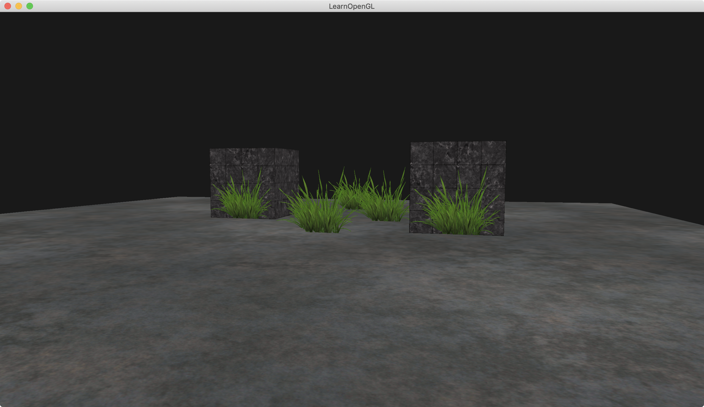
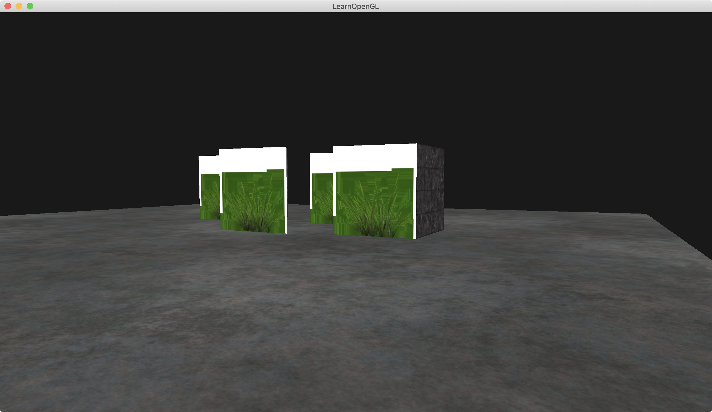
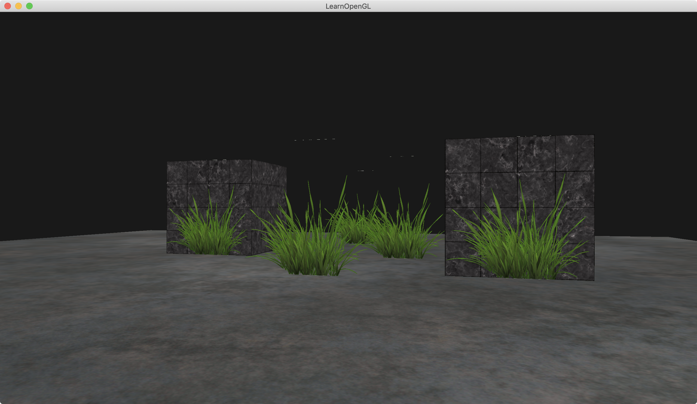

介绍：

画一个地板，画两个立方体箱子，画6个草，草能根据纹理，能穿透过去。




### Simple Code

```
#version 330 core
out vec4 FragColor;

in vec2 TexCoords;

uniform sampler2D texture1;

void main()
{             
    vec4 texColor = texture(texture1, TexCoords);
    if(texColor.a < 0.1)
        discard;
    FragColor = texColor;
}
```


若shader里没有discard，则：




注意，当采样纹理的边缘的时候，OpenGL会对边缘的值和纹理下一个重复的值进行插值（因为我们将它的环绕方式设置为了GL_REPEAT。这通常是没问题的，但是由于我们使用了透明值，纹理图像的顶部将会与底部边缘的纯色值进行插值。这样的结果是一个半透明的有色边框，你可能会看见它环绕着你的纹理四边形。要想避免这个，每当你alpha纹理的时候，请将纹理的环绕方式设置为GL_CLAMP_TO_EDGE：

```
// for this tutorial: use GL_CLAMP_TO_EDGE to prevent semi-transparent borders. Due to interpolation it takes texels from next repeat
glTexParameteri(GL_TEXTURE_2D, GL_TEXTURE_WRAP_S, format == GL_RGBA ? GL_CLAMP_TO_EDGE : GL_REPEAT); 
glTexParameteri(GL_TEXTURE_2D, GL_TEXTURE_WRAP_T, format == GL_RGBA ? GL_CLAMP_TO_EDGE : GL_REPEAT);
```

若不是GL_CLAMP_TO_EDGE，则

