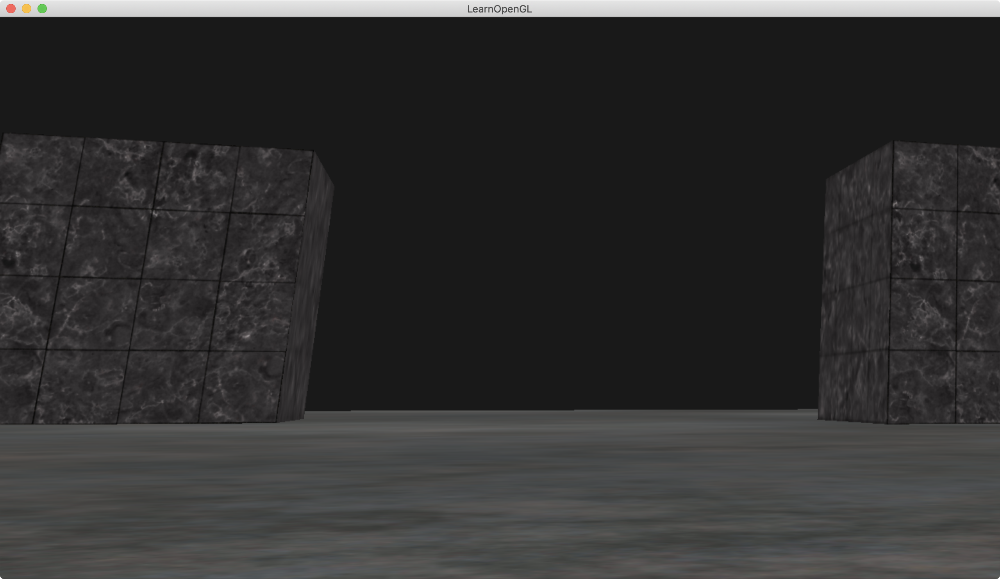
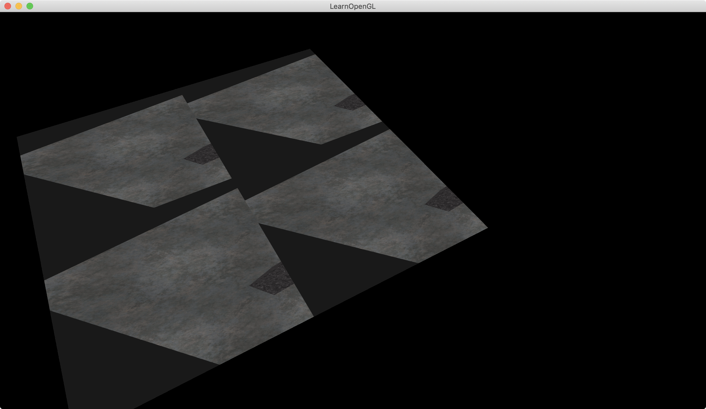

介绍：

Framebuffer

`__MODE_ORI__`

在framebuffer上，画地面，两个立方体箱子。然后在一个四边形mesh上画framebuffer对应的texture，这个四边形永远在近平面上，shader里把z变量写死了。




`__MODE_MY__`

在framebuffer上，画地面plane，两个立方体箱子cube。然后切到0 buffer上，再画地面plane，地面对应的纹理用framebuffer对应生成出来的纹理。




### Simple code

gen fbo;                                                       // 生成fbo

gen texture : (glTexImage2D     glFramebufferTexture2D))       // 生成纹理，调用glTexImage2D，只不过参数的pix数据为null，之后再将空纹理跟fbo绑在一起

gen rbo : (glRenderbufferStorage    glFramebufferRenderbuffer) // 生成render buffer object，并将rbo跟fbo绑在一起

```
// framebuffer configuration
// -------------------------
unsigned int framebuffer;
glGenFramebuffers(1, &framebuffer);
glBindFramebuffer(GL_FRAMEBUFFER, framebuffer);
// create a color attachment texture
unsigned int textureColorbuffer;
glGenTextures(1, &textureColorbuffer);
glBindTexture(GL_TEXTURE_2D, textureColorbuffer);
glTexImage2D(GL_TEXTURE_2D, 0, GL_RGB, SCR_WIDTH, SCR_HEIGHT, 0, GL_RGB, GL_UNSIGNED_BYTE, NULL);
glTexParameteri(GL_TEXTURE_2D, GL_TEXTURE_MIN_FILTER, GL_LINEAR);
glTexParameteri(GL_TEXTURE_2D, GL_TEXTURE_MAG_FILTER, GL_LINEAR);
glFramebufferTexture2D(GL_FRAMEBUFFER, GL_COLOR_ATTACHMENT0, GL_TEXTURE_2D, textureColorbuffer, 0);
// create a renderbuffer object for depth and stencil attachment (we won't be sampling these)
unsigned int rbo;
glGenRenderbuffers(1, &rbo);
glBindRenderbuffer(GL_RENDERBUFFER, rbo);
glRenderbufferStorage(GL_RENDERBUFFER, GL_DEPTH24_STENCIL8, SCR_WIDTH, SCR_HEIGHT); // use a single renderbuffer object for both a depth AND stencil buffer.
glFramebufferRenderbuffer(GL_FRAMEBUFFER, GL_DEPTH_STENCIL_ATTACHMENT, GL_RENDERBUFFER, rbo); // now actually attach it
// now that we actually created the framebuffer and added all attachments we want to check if it is actually complete now
if (glCheckFramebufferStatus(GL_FRAMEBUFFER) != GL_FRAMEBUFFER_COMPLETE)
	cout << "ERROR::FRAMEBUFFER:: Framebuffer is not complete!" << endl;
glBindFramebuffer(GL_FRAMEBUFFER, 0);
```

bind fbo；                                         // 绑定fbo

draw two cubes；draw plane        // 画两个箱子，画地面

change 0 fbo;                                    // 切到0的fbo上

draw rect using fbo's texture         // 画一个长方形的rect，纹理用刚才fbo生成的纹理

```
while (!glfwWindowShouldClose(window))
{
    ......

    // render
    // ------
    // bind to framebuffer and draw scene as we normally would to color texture 
    glBindFramebuffer(GL_FRAMEBUFFER, framebuffer);
    glEnable(GL_DEPTH_TEST); // enable depth testing (is disabled for rendering screen-space quad)

	// make sure we clear the framebuffer's content
	glClearColor(0.1f, 0.1f, 0.1f, 1.0f);
    glClear(GL_COLOR_BUFFER_BIT | GL_DEPTH_BUFFER_BIT);
    
    shader.use();
    glm::mat4 model = glm::mat4(1.0f);
    glm::mat4 view = camera.GetViewMatrix();
    glm::mat4 projection = glm::perspective(glm::radians(camera.Zoom), (float)SCR_WIDTH / (float)SCR_HEIGHT, 0.1f, 100.0f);
    shader.setMat4("view", view);
    shader.setMat4("projection", projection);
    // draw cubes
    ......
    // draw floor
    ......

#ifdef __MODE_ORI__
    glBindFramebuffer(GL_FRAMEBUFFER, 0);
    glDisable(GL_DEPTH_TEST);
    glClearColor(1.0f, 1.0f, 1.0f, 1.0f);
    glClear(GL_COLOR_BUFFER_BIT);
	screenShader.use();
    glBindVertexArray(quadVAO);
    glBindTexture(GL_TEXTURE_2D, textureColorbuffer);
    glDrawArrays(GL_TRIANGLES, 0, 6);
#endif

#ifdef __MODE_MY__
    glBindFramebuffer(GL_FRAMEBUFFER, 0);
    glClearColor(0.0f, 0.0f, 0.0f, 1.0f);
    glClear(GL_COLOR_BUFFER_BIT | GL_DEPTH_BUFFER_BIT);
    shader.use();
    shader.setInt("texture1", 0);
    glBindVertexArray(planeVAO);
    glBindTexture(GL_TEXTURE_2D, textureColorbuffer);
    shader.setMat4("model", glm::mat4(1.0f));
    glDrawArrays(GL_TRIANGLES, 0, 6);
    glBindVertexArray(0);
#endif

    ......
}
```

程序结束记得clear

```
    glDeleteVertexArrays(1, &cubeVAO);
    glDeleteVertexArrays(1, &planeVAO);
    glDeleteVertexArrays(1, &quadVAO);
    glDeleteBuffers(1, &cubeVBO);
    glDeleteBuffers(1, &planeVBO);
    glDeleteBuffers(1, &quadVBO);
    glDeleteRenderbuffers(1, &rbo);
    glDeleteFramebuffers(1, &framebuffer);
    glDeleteTextures(1, &textureColorbuffer);
    glDeleteTextures(1, &cubeTexture);
    glDeleteTextures(1, &floorTexture);
    glDeleteProgram(shader.ID);
    glDeleteProgram(screenShader.ID);
```


