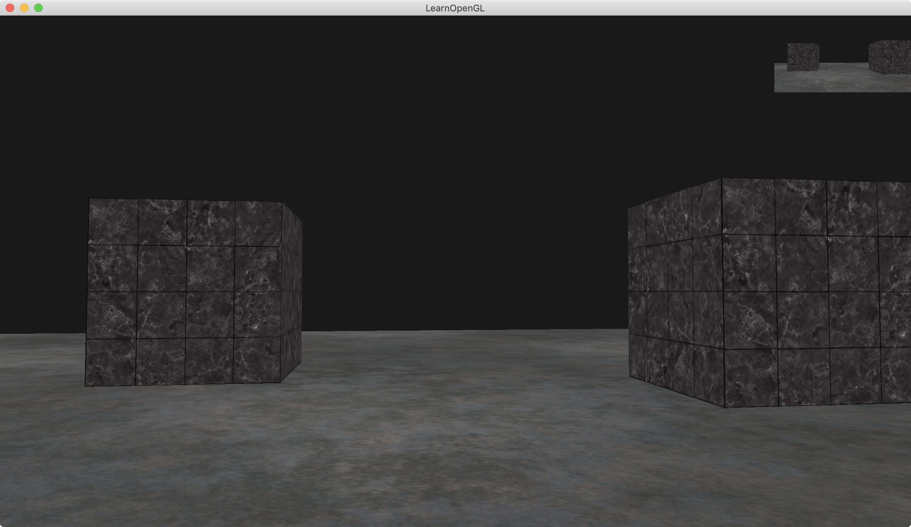
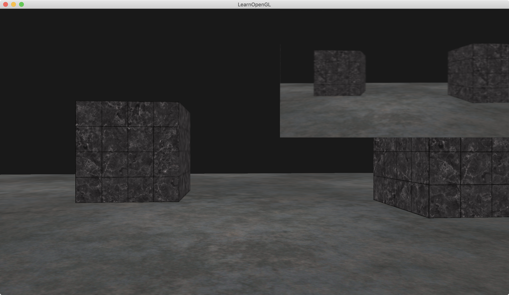
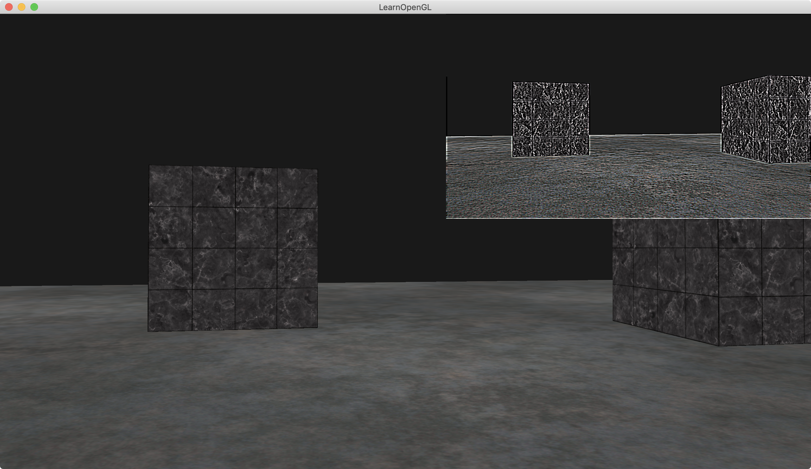
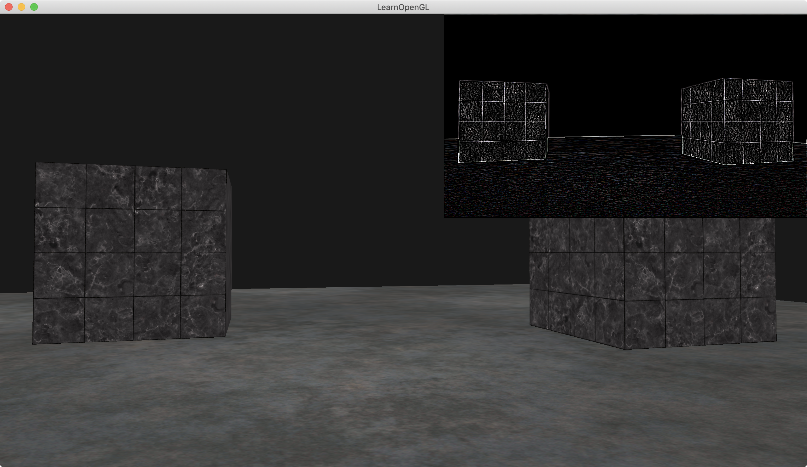

介绍：

右上角有一个“预览框”，通过framebuffer实现，预览框实现高斯模糊。

案例在mac上有bug（其他平台没试），bug：代码create的window大小是1280x720，但实际window大小是2560x1440。解决bug：可以按`ctrl + command + f`，将窗口变大再变小即可，目的是更新window size。




### Simple code

生成fbo，textureID，rbo的方法

```c++
void genFBO(unsigned int* framebuffer, unsigned int* textureColorbuffer, unsigned int* rbo) {
    glDeleteTextures(1, textureColorbuffer);
    glDeleteFramebuffers(1, framebuffer);
    glDeleteRenderbuffers(1, rbo);

    cout << "genFBO framebuffer = " << *framebuffer << " textureColorbuffer = " << *textureColorbuffer << " rbo = " << *rbo << endl;
    cout << "genFBO current_width = " << current_width << " current_height = " << current_height << endl;

    glGenFramebuffers(1, framebuffer);
    glBindFramebuffer(GL_FRAMEBUFFER, *framebuffer);

    // create a color attachment texture
    glGenTextures(1, textureColorbuffer);
    glBindTexture(GL_TEXTURE_2D, *textureColorbuffer);
    glTexImage2D(GL_TEXTURE_2D, 0, GL_RGB, current_width, current_height, 0, GL_RGB, GL_UNSIGNED_BYTE, NULL);
    glTexParameteri(GL_TEXTURE_2D, GL_TEXTURE_MIN_FILTER, GL_LINEAR);
    glTexParameteri(GL_TEXTURE_2D, GL_TEXTURE_MAG_FILTER, GL_LINEAR);
    glFramebufferTexture2D(GL_FRAMEBUFFER, GL_COLOR_ATTACHMENT0, GL_TEXTURE_2D, *textureColorbuffer, 0);

    // create a renderbuffer object for depth and stencil attachment (we won't be sampling these)
    glGenRenderbuffers(1, rbo);
    glBindRenderbuffer(GL_RENDERBUFFER, *rbo);
    glRenderbufferStorage(GL_RENDERBUFFER, GL_DEPTH24_STENCIL8, current_width, current_height); // use a single renderbuffer object for both a depth AND stencil buffer.
    glFramebufferRenderbuffer(GL_FRAMEBUFFER, GL_DEPTH_STENCIL_ATTACHMENT, GL_RENDERBUFFER, *rbo); // now actually attach it

    // now that we actually created the framebuffer and added all attachments we want to check if it is actually complete now
    if (glCheckFramebufferStatus(GL_FRAMEBUFFER) != GL_FRAMEBUFFER_COMPLETE)
        cout << "ERROR::FRAMEBUFFER:: Framebuffer is not complete!" << endl;

    glBindFramebuffer(GL_FRAMEBUFFER, 0);

    cout << "genFBO framebuffer = " << *framebuffer << " textureColorbuffer = " << *textureColorbuffer << " rbo = " << *rbo << endl;
}
```

如何实现“预览框”永远在近平面上：

顶点着色器里，最终算出来的gl_Position的x值和y值，范围在[-1, 1]，z为0。利用此结论(NDC坐标)，将预览框的shader的z值写死，为0，xy值从cpu传入，x:[0.7,1] y:[0.7,1]，则预览框就出现在了右上角。

```c++
float xMin = 0.7f;
float xMax = 1.0f;
float yMin = 0.7f;
float yMax = 1.0f;
float quadVertices[] = { // vertex attributes for a quad that fills the entire screen in Normalized Device Coordinates. NOTE that this plane is now much smaller and at the top of the screen
    // positions   // texCoords
    xMin,  yMax,  0.0f, 1.0f,
    xMin,  yMin,  0.0f, 0.0f,
    xMax,  yMin,  1.0f, 0.0f,

    xMin,  yMax,  0.0f, 1.0f,
    xMax,  yMin,  1.0f, 0.0f,
    xMax,  yMax,  1.0f, 1.0f
};

-------------------- vertex shader --------------------
#version 330 core
layout (location = 0) in vec2 aPos;
layout (location = 1) in vec2 aTexCoords;

out vec2 TexCoords;

void main()
{
    TexCoords = aTexCoords;
    gl_Position = vec4(aPos.x, aPos.y, 0.0, 1.0); 
}  

-------------------- fragment shader --------------------
#version 330 core
out vec4 FragColor;

in vec2 TexCoords;

uniform sampler2D screenTexture;

void main()
{
    vec3 col = texture(screenTexture, TexCoords).rgb;
    FragColor = vec4(col, 1.0);
} 
```

shader里如何实现高斯

```c++
#version 330 core
out vec4 FragColor;

in vec2 TexCoords;

uniform sampler2D screenTexture;

// ------------------- normal ------------------------ 1
//void main()
//{
//    vec3 col = texture(screenTexture, TexCoords).rgb;
//    FragColor = vec4(col, 1.0);
//}
// ------------------- normal ------------------------ 2

// +++++++++++++++++++ gaussian blur ++++++++++++++++++++ 1
const float offset = 1.0 / 300.0; // 可以更改半径值来控制模糊程度，分母越小越模糊

void main()
{
    vec2 offsets[9] = vec2[](
        vec2(-offset,  offset), // 左上
        vec2( 0.0f,    offset), // 正上
        vec2( offset,  offset), // 右上
        vec2(-offset,  0.0f),   // 左
        vec2( 0.0f,    0.0f),   // 中
        vec2( offset,  0.0f),   // 右
        vec2(-offset, -offset), // 左下
        vec2( 0.0f,   -offset), // 正下
        vec2( offset, -offset)  // 右下
    );

    // 核效果
    //float kernel[9] = float[](
    //    -1, -1, -1,
    //    -1,  9, -1,
    //    -1, -1, -1
    //);

    // 高斯模糊
    //float kernel[9] = float[](
    //    1.0 / 16, 2.0 / 16, 1.0 / 16,
    //    2.0 / 16, 4.0 / 16, 2.0 / 16,
    //    1.0 / 16, 2.0 / 16, 1.0 / 16
    //);
  
  	// 边缘检测
    float kernel[9] = float[](
        1, 1, 1,
        1, -8, 1,
        1, 1, 1
    );

    vec3 sampleTex[9];
    for(int i = 0; i < 9; i++)
    {
        sampleTex[i] = vec3(texture(screenTexture, TexCoords.st + offsets[i]));
    }
    vec3 col = vec3(0.0);
    for(int i = 0; i < 9; i++)
        col += sampleTex[i] * kernel[i];

    FragColor = vec4(col, 1.0);
}
// +++++++++++++++++++ gaussian blur ++++++++++++++++++++ 2
```


高斯模糊效果：




核效果：




边缘检测：

