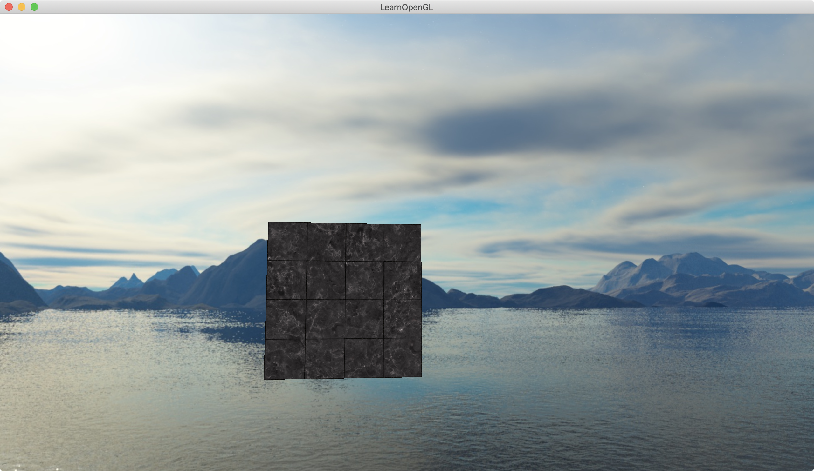

介绍：

实现天空盒。




### Simple code

 天空盒纹理加载

除了有`GL_TEXTURE_2D`，还有`GL_TEXTURE_CUBE_MAP`

除了有`GL_TEXTURE_WRAP_S`，`GL_TEXTURE_WRAP_T`，还有`GL_TEXTURE_WRAP_R`

| 纹理目标                         | 方位 |
| -------------------------------- | ---- |
| `GL_TEXTURE_CUBE_MAP_POSITIVE_X` | 右   |
| `GL_TEXTURE_CUBE_MAP_NEGATIVE_X` | 左   |
| `GL_TEXTURE_CUBE_MAP_POSITIVE_Y` | 上   |
| `GL_TEXTURE_CUBE_MAP_NEGATIVE_Y` | 下   |
| `GL_TEXTURE_CUBE_MAP_POSITIVE_Z` | 后   |
| `GL_TEXTURE_CUBE_MAP_NEGATIVE_Z` | 前   |

```c++
// loads a cubemap texture from 6 individual texture faces
// order:
// +X (right)
// -X (left)
// +Y (top)
// -Y (bottom)
// +Z (front) 
// -Z (back)
// -------------------------------------------------------
unsigned int loadCubemap(vector<std::string> faces)
{
    unsigned int textureID;
    glGenTextures(1, &textureID);
    glBindTexture(GL_TEXTURE_CUBE_MAP, textureID);

    int width, height, nrChannels;
    for (unsigned int i = 0; i < faces.size(); i++)
    {
        unsigned char *data = stbi_load(faces[i].c_str(), &width, &height, &nrChannels, 0);
        if (data)
        {
            glTexImage2D(GL_TEXTURE_CUBE_MAP_POSITIVE_X + i, 0, GL_RGB, width, height, 0, GL_RGB, GL_UNSIGNED_BYTE, data);
            stbi_image_free(data);
        }
        else
        {
            std::cout << "Cubemap texture failed to load at path: " << faces[i] << std::endl;
            stbi_image_free(data);
        }
    }
    glTexParameteri(GL_TEXTURE_CUBE_MAP, GL_TEXTURE_MIN_FILTER, GL_LINEAR);
    glTexParameteri(GL_TEXTURE_CUBE_MAP, GL_TEXTURE_MAG_FILTER, GL_LINEAR);
    glTexParameteri(GL_TEXTURE_CUBE_MAP, GL_TEXTURE_WRAP_S, GL_CLAMP_TO_EDGE);
    glTexParameteri(GL_TEXTURE_CUBE_MAP, GL_TEXTURE_WRAP_T, GL_CLAMP_TO_EDGE);
    glTexParameteri(GL_TEXTURE_CUBE_MAP, GL_TEXTURE_WRAP_R, GL_CLAMP_TO_EDGE);

    return textureID;
}

----------------------------- load cube map -------------------------------------
vector<std::string> faces
{
	FileSystem::getPath("resources/textures/skybox/right.jpg"),
    FileSystem::getPath("resources/textures/skybox/left.jpg"),
    FileSystem::getPath("resources/textures/skybox/top.jpg"),
    FileSystem::getPath("resources/textures/skybox/bottom.jpg"),
    FileSystem::getPath("resources/textures/skybox/front.jpg"),
    FileSystem::getPath("resources/textures/skybox/back.jpg")
};
unsigned int cubemapTexture = loadCubemap(faces);
```

shader里除了`sampler2D`还有`samplerCube`

gl_Position = pos.xyww

```c
-------- vertex shader --------
#version 330 core
layout (location = 0) in vec3 aPos;

out vec3 TexCoords;

uniform mat4 projection;
uniform mat4 view;

void main()
{
    TexCoords = aPos;
    vec4 pos = projection * view * vec4(aPos, 1.0);
    gl_Position = pos.xyww;
}  


-------- fragment shader --------
#version 330 core
out vec4 FragColor;

in vec3 TexCoords; // 这里是vec3，不是vec2

uniform samplerCube skybox;

void main()
{    
    FragColor = texture(skybox, TexCoords);
}
```

绘制时，更改深度测试方法

```c++
// draw skybox as last ------------- begin -------------
// 天空盒子的深度(1) 小于等于 深度buffer里的值， 则深度检测通过
glDepthFunc(GL_LEQUAL);  // change depth function so depth test passes when values are equal to depth buffer's content
skyboxShader.use();
// remove translation from the view matrix
// 移除位移信息: 将4x4矩阵的camera view矩阵变成3x3，就把camera的位移信息移除了
// 目的：这将使天空盒移除移位，但保留旋转，玩家仍然能够环顾场景
view = glm::mat4(glm::mat3(camera.GetViewMatrix()));
skyboxShader.setMat4("view", view);
skyboxShader.setMat4("projection", projection);
// skybox cube
glBindVertexArray(skyboxVAO);
glActiveTexture(GL_TEXTURE0);
glBindTexture(GL_TEXTURE_CUBE_MAP, cubemapTexture);
glDrawArrays(GL_TRIANGLES, 0, 36);
glBindVertexArray(0);
glDepthFunc(GL_LESS); // set depth function back to default
// draw skybox as last ------------- end ---------------
```


优化：

​	自己写代码，很容易先绘制天空盒，后画天空盒里的物体。因为若先绘制物体再绘制天空盒的话，还得解决谁遮挡谁的问题。但是前者的方案是有优化的空间的。若先画天空盒，就会对屏幕上每一个像素点运行一遍片元着色器，即使当前只有很少一部分天空盒漏出来，但是也要经过全屏每一个点计算片元着色器。

​	为了节省宝贵的带宽，提升微弱的性能，我们最后绘制天空盒。让最后的天空盒的深度永远设置为最深，即为1.只有通过了深度测试才会执行到片源着色器，一定程度上减少片源着色器的调用。

​	怎么设置天空盒的深度永远为1，在顶点着色器的gl_Position的z设置为w即可，即gl_Position=pos.xyww，这样在顶点着色器之后的归一化操作后，z深度就为1. 只要天空盒的深度(1) 小于等于(`glDepthFunc(GL_LEQUAL)`) 深度buffer里的深度值，则深度检测通过，进行绘制。（深度越大，值越大）