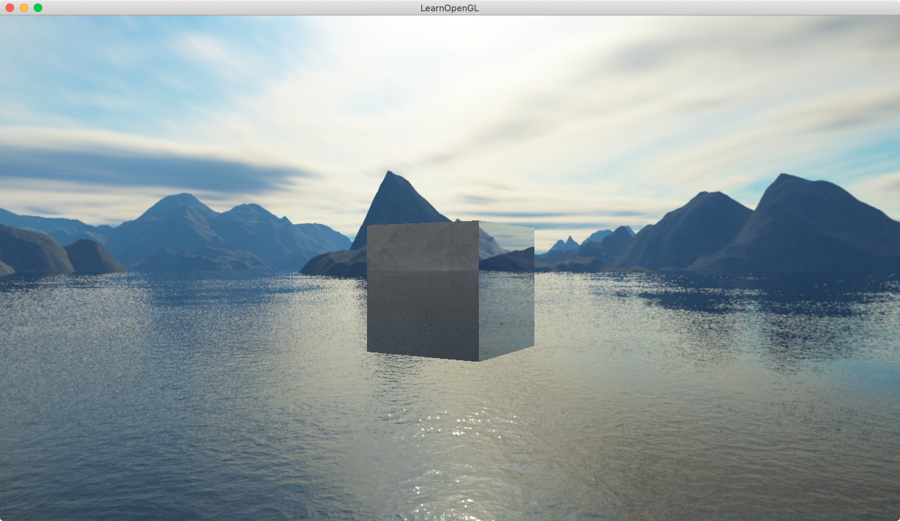

介绍：给盒子加上反射（这里只反射天空盒的贴图）





反射纹理计算：

vs:

```
#version 330 core
layout (location = 0) in vec3 aPos;
layout (location = 1) in vec3 aNormal;

out vec3 Normal;
out vec3 Position;

uniform mat4 model;
uniform mat4 view;
uniform mat4 projection;

void main()
{
// 这里提供 顶点着色器 中时时计算法向量的一种方法：model矩阵先逆矩阵，再转置，再取3x3，然后乘以 法向量
    Normal = mat3(transpose(inverse(model))) * aNormal; 
// model矩阵 直接乘以 位置坐标，就是该坐标在物理世界上的位置，为方便在 片源着色器 里 计算入射光向量 用的
    Position = vec3(model * vec4(aPos, 1.0)); 
    gl_Position = projection * view * model * vec4(aPos, 1.0);
}
```

fs:

```
#version 330 core
out vec4 FragColor;

in vec3 Normal;
in vec3 Position;

uniform vec3 cameraPos;
uniform samplerCube skybox;

void main()
{    
		// I向量方向为 摄像机方向 指向 物体位置；单位化。为入射光向量。
    vec3 I = normalize(Position - cameraPos); 
    // R向量 = I向量 与 单位化后的法向量Normal，做reflect反射
    vec3 R = reflect(I, normalize(Normal));
    // R向量直接作用于天空盒贴图采样（此位置的贴图使用 R向量 去 采样 samplerCube纹理）
    // 这里 texture函数中：一个samplerCube 是 需要与 一个vec3的纹理坐标 计算的
    FragColor = vec4(texture(skybox, R).rgb, 1.0); 
}
```


**折射可以使用GLSL的内建refrect函数来轻松实现，它需要一个法向量、一个观察方向和两个材质之间的折射率(Refractive Index)**。


---


通过使用帧缓冲，我们能够为物体的6个不同角度创建出场景的纹理，并在每个渲染迭代中将它们储存到一个立方体贴图中。之后我们就可以使用这个（动态生成的）立方体贴图来创建出更真实的，包含其它物体的，反射和折射表面了。这就叫做**动态环境映射(Dynamic Environment Mapping)**，因为我们动态创建了物体周围的立方体贴图，并将其用作环境贴图。

虽然它看起来很棒，但它有一个很大的缺点：我们需要为使用环境贴图的物体渲染场景6次，这是对程序是非常大的性能开销。现代的程序通常会尽可能使用天空盒，并在可能的时候使用预编译的立方体贴图，只要它们能产生一点动态环境贴图的效果。虽然动态环境贴图是一个很棒的技术，但是要想在不降低性能的情况下让它工作还是需要非常多的技巧的。


---


若要使用assimp加载obj，里面有很多小细节需要注意：aiTextureType_AMBIENT