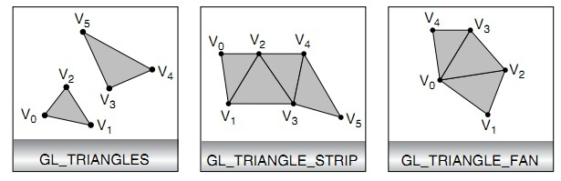
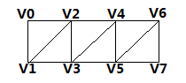
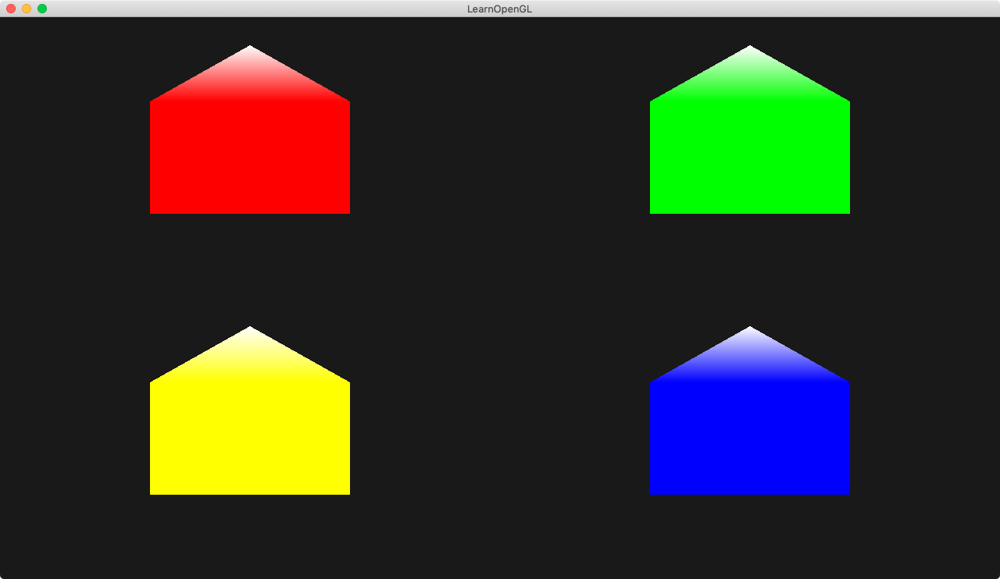

---


Triangle_strip环绕方式理解：

​		v1，v2，v3，v4，v5........

​	环绕方式为:

​			v0 v1 v2

​			v1 v3 v2

​			v2 v3 v4

​			v3 v5 v4

(https://blog.csdn.net/qq526495605/article/details/47688841)

看下图比较好记：



<font color=red>数据竖着摆，然后画个斜线，然后按逆时针绕，顺序就出来了。</font>


------------------------------------------------------------------------------------------------------------------------------------------


Triangle_fun环绕方式理解：

​		v1，v2，v3，v4，v5........

​	环绕方式为:

​		v1, v2, v3

​		v1, v3, v4

​		v1, v4, v5

(https://blog.csdn.net/xiajun07061225/article/details/7455283)


---


demo介绍：




搞四个房子。每个房子颜色不同，房顶都是白色的。每个房子是有5个点组成。

而我们往顶点着色器传顶点的时候，其实只有4个房子的中心位置。

4个中心位置如何变成5个房子的？几何着色器生效了。

几何着色器把每个中心位置的顶点，通过translate变换，搞出来5个点。


顶点着色器 ---> 几何着色器 --> 光栅化 --> 片元着色器

顶点着色器走了四次，几何着色器也走四次，光栅话后再给片源着色器。


draw:

```
glDrawArrays(GL_POINTS, 0, 4); // 这里只是指定画4个点
```

vs:

```
#version 330 core
layout (location = 0) in vec2 aPos;
layout (location = 1) in vec3 aColor;

out VS_OUT {
    vec3 color;
} vs_out;

void main()
{
    vs_out.color = aColor;
    gl_Position = vec4(aPos.x, aPos.y, 0.0, 1.0); 
}
```

gs:

```
#version 330 core
layout (points) in;
layout (triangle_strip, max_vertices = 5) out;

in VS_OUT {
    vec3 color;
} gsIn[];

out vec3 fColor;

// 有多少个顶点，这里就走多少次，vs走4次，则gs也走4次。
// 这里会单独处理每一个顶点，这里是将1个点变成5个点
void build_house(vec4 position)
{   
    fColor = gsIn[0].color; // gsIn[0] since there's only one input vertex
    gl_Position = position + vec4(-0.2, -0.2, 0.0, 0.0); // 1:bottom-left
    EmitVertex();           // 创建左下的点，然后提交，此时提交顶点对应的颜色是fColor
    gl_Position = position + vec4( 0.2, -0.2, 0.0, 0.0); // 2:bottom-right
    EmitVertex();
    gl_Position = position + vec4(-0.2,  0.2, 0.0, 0.0); // 3:top-left
    EmitVertex();
    gl_Position = position + vec4( 0.2,  0.2, 0.0, 0.0); // 4:top-right
    EmitVertex();
    gl_Position = position + vec4( 0.0,  0.4, 0.0, 0.0); // 5:top
    fColor = vec3(1.0, 1.0, 1.0); // 这个颜色值只生效于top点
    EmitVertex();                 // 创建top的点，然后提交，此时提交顶点对应的颜色是fColor
    EndPrimitive();               // 最后调用 EndPrimitive 结束
}

void main() {
    // 通过 gl_in[0].gl_Position 可以获取从vs传来的顶点数据
    build_house(gl_in[0].gl_Position);
}
```

fs:

```
#version 330 core
out vec4 FragColor;

in vec3 fColor;

void main()
{
    FragColor = vec4(fColor, 1.0);   
}
```


